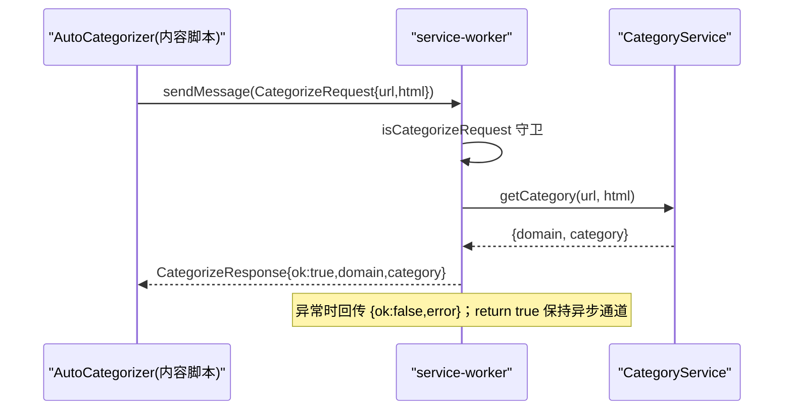

# 消息传递机制

<cite>
**本文引用的文件**
- [src/messages.ts](file://src/messages.ts)
- [src/content/AutoCategorizer.ts](file://src/content/AutoCategorizer.ts)
- [src/background/service-worker.ts](file://src/background/service-worker.ts)
</cite>

## 目录
1. [简介](#简介)
2. [消息类型定义](#消息类型定义)
3. [类型守卫](#类型守卫)
4. [请求/响应流程](#请求响应流程)

## 简介
BrainRest 使用两种通信方式：一次性的 `chrome.runtime.sendMessage`（用于分类请求），以及长连接 Port（用于事件流，见 [事件系统](事件系统.md)）。本节聚焦前者。

## 消息类型定义
[src/messages.ts](file://src/messages.ts) 定义分类请求/响应契约：

```ts
export interface CategorizeRequest {
  type: "categorize";
  url: string;
  html: string;
}

export interface CategorizeResponse {
  ok: boolean;
  error?: string;
  domain?: string;
  category?: string;
}

export type RuntimeMessage = CategorizeRequest;
```

## 类型守卫
```ts
export function isCategorizeRequest(msg: unknown): msg is CategorizeRequest
```
背景服务用它在 `onMessage` 中过滤合法的分类请求。

## 请求/响应流程



图表来源
- [src/content/AutoCategorizer.ts](file://src/content/AutoCategorizer.ts)
- [src/background/service-worker.ts](file://src/background/service-worker.ts)

**章节来源**
- [src/messages.ts](file://src/messages.ts#L1-L23)
- [src/background/service-worker.ts](file://src/background/service-worker.ts#L1-L53)
