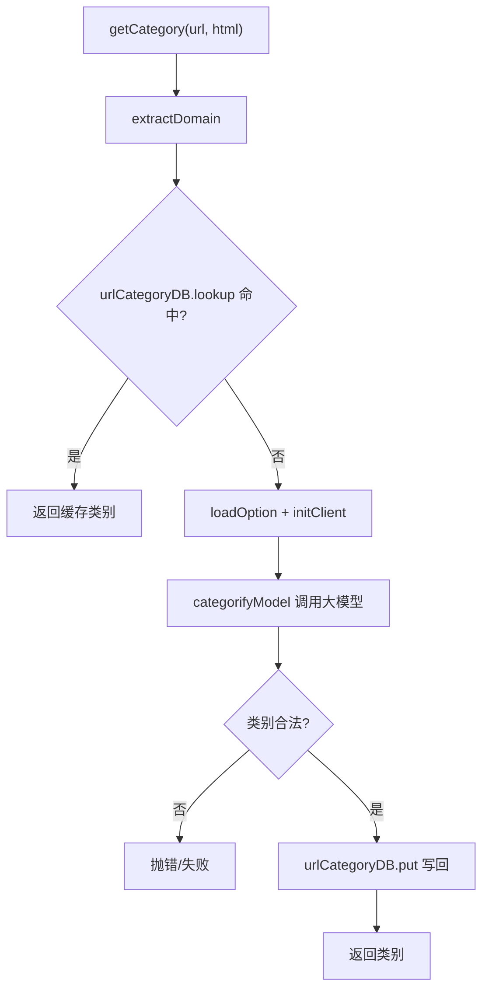

# 分类服务

<cite>
**本文引用的文件**
- [src/services/CategoryService.ts](file://src/services/CategoryService.ts)
- [src/services/AI.ts](file://src/services/AI.ts)
- [src/services/UrlCategoryDataBaseManager.ts](file://src/services/UrlCategoryDataBaseManager.ts)
- [src/services/OptionStore.ts](file://src/services/OptionStore.ts)
- [src/models/types.ts](file://src/models/types.ts)
</cite>

## 目录

1. [简介](#简介)
2. [getCategory](#getcategory)
3. [辅助函数](#辅助函数)
4. [分类提示词与输出契约](#分类提示词与输出契约)
5. [完整流程](#完整流程)

## 简介

[src/services/CategoryService.ts](file://src/services/CategoryService.ts) 编排 URL 分类：缓存优先，未命中则调用 AI
模型，并将结果写回缓存。分类结果属于 11 类 `UrlCategory` 之一。

## getCategory

```ts
async function getCategory(url: string, html: string, option?: Option): Promise<...>
```

主入口。流程：`extractDomain` → `getCategoryFromDB`（命中即返回）→ 未命中则 `loadOption` + `initClient` + `categorifyModel`
调用模型 → 校验类别合法 → `urlCategoryDB.put` 写回。

## 辅助函数

| 函数                                | 说明                                                          |
|-------------------------------------|---------------------------------------------------------------|
| `categorifyPrompt`                  | 构造包含 11 类定义的提示词，要求输出两行（domain / category） |
| `categorifyModel(model, url, html)` | 调用 `client.chat.completions.create`，解析并校验返回类别     |
| `extractDomain(url)`                | 从 URL 提取域名                                               |
| `getCategoryFromDB`                 | 走 `urlCategoryDB.lookup` 查缓存                              |
| `setCategory`                       | 手动写入 `(domain → category)`                                |

## 分类提示词与输出契约

提示词内置 11 个类别及其判定说明，约束模型输出为严格两行文本：第一行为归一化 domain，第二行为类别标识。`categorifyModel`
会校验第二行必须属于 [UrlCategory](file://src/models/types.ts) 枚举，否则视为无效。

## 完整流程



图表来源

- [src/services/CategoryService.ts](file://src/services/CategoryService.ts)

**章节来源**

- [src/services/CategoryService.ts](file://src/services/CategoryService.ts#L1-L164)
- [src/models/types.ts](file://src/models/types.ts#L1-L14)
