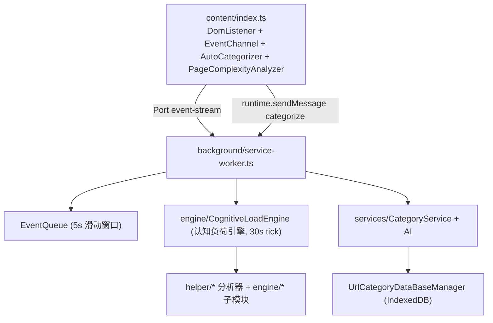
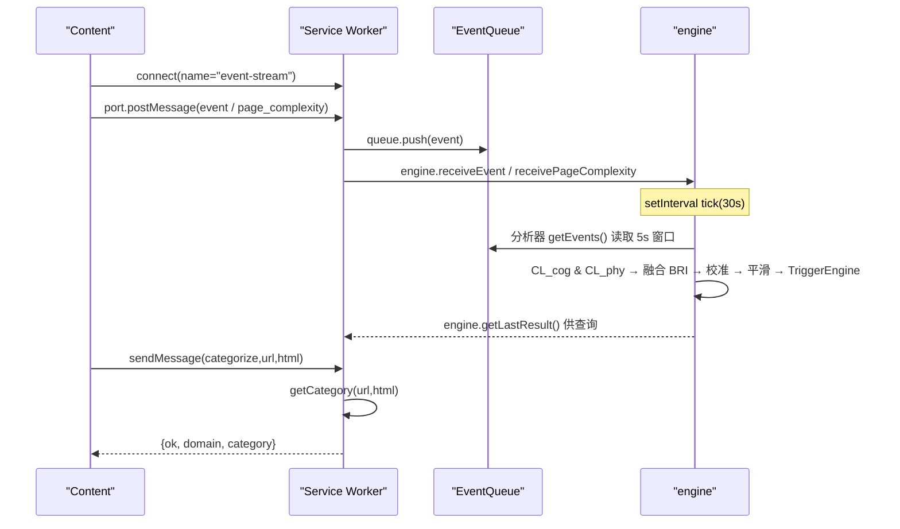

# 开发指南

<cite>
**本文引用的文件**
- [README.md](file://README.md)
- [package.json](file://package.json)
- [vite.config.ts](file://vite.config.ts)
- [src/manifest.ts](file://src/manifest.ts)
- [src/background/service-worker.ts](file://src/background/service-worker.ts)
- [src/background/engine/CognitiveLoadEngine.ts](file://src/background/engine/CognitiveLoadEngine.ts)
- [src/background/EventQueue.ts](file://src/background/EventQueue.ts)
- [src/content/index.ts](file://src/content/index.ts)
- [src/content/EventChannel.ts](file://src/content/EventChannel.ts)
- [src/messages.ts](file://src/messages.ts)
</cite>

## 目录

1. [简介](#简介)
2. [环境搭建](#环境搭建)
3. [项目结构](#项目结构)
4. [运行时架构](#运行时架构)
5. [关键模块职责](#关键模块职责)
6. [新增功能指引](#新增功能指引)
7. [调试技巧](#调试技巧)
8. [代码规范](#代码规范)
9. [当前限制](#当前限制)

## 简介

本指南面向 BrainRest 贡献者。BrainRest 是一个 Chrome MV3 扩展，通过内容脚本采集用户交互事件与页面复杂度，在后台 service worker
中由每 30 秒运行的认知负荷引擎融合认知负荷（CL_cog）与身体疲劳（CL_phy）计算“脑休息指数 BRI（Brain Rest Index）”，并评估三条触发路径（结果由前端决定如何提醒）。此外后台还提供基于 AI 的 URL
分类能力。本文只描述仓库中真实存在的实现。

## 环境搭建

- Node.js：建议使用较新的 LTS 版本（Vite 8 要求较新 Node）。
- 安装依赖：在项目根目录运行 `npm install`。
- 开发：`npm run dev` 启动 Vite（CRXJS 提供扩展 HMR）。
- 构建：`npm run build`（`tsc -b && vite build`），产物在 `dist`。
- 加载扩展：Chrome 打开 `chrome://extensions`，开启开发者模式，「加载已解压的扩展程序」，选择 `dist` 目录。
- 代码检查：`npm run lint`。

章节来源

- [package.json](file://package.json)
- [vite.config.ts](file://vite.config.ts)

## 项目结构

按功能域组织于 `src` 下：

- `background/`：service worker 及其监听器、事件队列、认知负荷引擎（`engine/CognitiveLoadEngine` 等）与 `helper/` 分析器。
- `content/`：注入页面的内容脚本，采集 DOM 事件与页面复杂度并通过 Port 上报，另含 `AutoCategorizer` 触发分类。
- `models/`：事件模型（`models/events`）、`Option`、`types` 等类型定义。
- `services/`：AI 客户端、分类服务、Option 存储、两个 IndexedDB 管理器。
- `popup/`：React 占位 UI（当前未在清单中启用）。
- `manifest.ts`：MV3 清单源。

图表来源

- [src/content/index.ts](file://src/content/index.ts)
- [src/background/service-worker.ts](file://src/background/service-worker.ts)
- [src/background/engine/CognitiveLoadEngine.ts](file://src/background/engine/CognitiveLoadEngine.ts)
- [src/background/EventQueue.ts](file://src/background/EventQueue.ts)

章节来源

- [README.md](file://README.md)
- [src/manifest.ts](file://src/manifest.ts)

## 运行时架构

存在两条独立通路：

1. **事件流（长连接 Port）**：内容脚本通过 `chrome.runtime.connect({ name: "event-stream" })` 建立 Port，`DomListener` 采集的
   UI 事件经 `EventChannel.sendEvent` 发送；service worker 在 `onConnect` 中接收并 `queue.push(event)`。后台的
   `TabListener`/`WindowFocusListener`/`IdleListener` 直接向同一队列推送标签页/窗口/空闲事件。
2. **分类请求（一次性消息）**：`AutoCategorizer` 在页面加载后经 `chrome.runtime.sendMessage` 发送
   `{ type: "categorize", url, html }`；service worker 用 `isCategorizeRequest` 校验后调用 `getCategory` 返回
   `{ ok, domain, category }`。

图表来源

- [src/background/service-worker.ts](file://src/background/service-worker.ts)
- [src/content/EventChannel.ts](file://src/content/EventChannel.ts)
- [src/messages.ts](file://src/messages.ts)

章节来源

- [src/background/service-worker.ts](file://src/background/service-worker.ts)

## 关键模块职责

- **service-worker.ts**：导入监听器（副作用注册），`engine.start()`；处理 Port 连接（转发事件/页面复杂度给引擎并入队）与
  categorize 消息。引擎为纯计算，不注册触发回调。
- **engine/CognitiveLoadEngine.ts**：单例 `engine`，每 30 秒 `tick`：经 `DataQualityGate` 校验 120s 覆盖率后，计算认知负荷 CL_cog
  （时长/切换/页面类型/文本密度）与身体疲劳 CL_phy（轨迹熵/眼手延迟/交互频率/删除键占比），融合为
  `BRI_raw = min(max(CL_cog,CL_phy) + 0.30·min(CL_cog,CL_phy), 100)`，乘个人校准 k_personal 再一阶低通平滑（α=0.25），分级（40/70），并调用 `TriggerEngine` 评估路径 A/B/C。
- **EventQueue.ts**：`SlidingWindowQueue`，`push()` 时按 5000ms 窗口 `trim()`，`getEvents()` 返回窗口内事件副本。
- **helper/**：`MouseTrackAnalyzer`（鼠标方向熵与眼手延迟）、`EventFrequencyAnalyzer`、`KeyboardAnalyzer`（删除键占比）被
  `PhysicalFatigueCalculator` 使用；`TabSwitchAnalyzer` 目前未接入（切换负荷改由 `engine/TabEventBuffer` 统计）。
- **content**：`DomListener` 采集 mousemove（采样）、click、keydown/keyup、scroll、touch、fullscreenchange；`EventChannel` 负责
  Port 发送；`AutoCategorizer` 发起分类。
- **services**：`AI`（OpenAI/DeepSeek 客户端）、`CategoryService`（11 类分类 + DB 缓存）、`OptionStore`（配置存取）、
  `UrlCategoryDataBaseManager`（域名分类库）、`EventDataBaseManager`（事件库， **当前未被引用**）。

章节来源

- [src/background/service-worker.ts](file://src/background/service-worker.ts)
- [src/background/engine/CognitiveLoadEngine.ts](file://src/background/engine/CognitiveLoadEngine.ts)
- [src/background/EventQueue.ts](file://src/background/EventQueue.ts)

## 新增功能指引

- **新增一种采集事件**：在 `models/events` 中定义事件接口（继承 `Event`/`UiEvent`/`TabEvent`），在 `DomListener` 或对应后台监听器中通过
  `createEvent` 构造并发送/入队。
- **让 BRI 使用新物理信号**：在 `helper/` 添加分析器，在 `PhysicalFatigueCalculator`（或 `CognitiveLoadCalculator`）中接入并调整对应权重（注意各子权重之和需与公式一致）。
- **消费 BRI 结果**：`engine.getLastResult()` 读取最近一次 `BRIResult`（含 `triggerPath`），由前端决定如何提醒。
- **新增消息类型**：在 `messages.ts` 定义请求/响应类型与类型守卫，并在 service worker 的 `onMessage` 中处理。

章节来源

- [src/messages.ts](file://src/messages.ts)
- [src/background/engine/CognitiveLoadEngine.ts](file://src/background/engine/CognitiveLoadEngine.ts)

## 调试技巧

- **后台**：在 `chrome://extensions` 中打开该扩展的 service worker「检查视图」，可在控制台调用 `engine.getLastResult()` 观察 BRI 结果与
  categorize 处理日志。构建默认不压缩且带 sourcemap，便于断点。
- **内容脚本**：在目标页面 DevTools 的 Sources 中定位 `src/content/*`，观察事件采集与 Port 发送。
- **存储**：个人校准系数存于 `chrome.storage.local` 键 `brainrest_k_personal`；Option 存于 `brainrest_option`；分类结果存于
  IndexedDB `brainrest_url_categories`。

章节来源

- [src/background/engine/CognitiveLoadEngine.ts](file://src/background/engine/CognitiveLoadEngine.ts)

## 代码规范

- TypeScript 严格选项已开启（`noUnusedLocals`、`noUnusedParameters` 等），提交前确保 `tsc -b` 与 `npm run lint` 通过。
- 错误处理采用原生 `throw new Error(...)` 的轻量方式，无统一日志系统。
- 事件对象统一经 `createEvent` 创建，保证 `timestamp`/`type`/`processed`/`url` 字段一致。

章节来源

- [package.json](file://package.json)
- [src/models/events/Event.ts](file://src/models/events/Event.ts)

## 当前限制

- popup UI 为占位（`Hello Extension`）且未在清单中启用。
- `EventDataBaseManager`、`MediaEvent`、`TimeData`、`TabSwitchAnalyzer`
  均已实现但未接入主流程。
- 引擎仅输出 `BRIResult`（含 triggerPath），尚无用户可见的提醒 UI。
- 无自动化测试。

章节来源

- [src/manifest.ts](file://src/manifest.ts)
- [src/background/service-worker.ts](file://src/background/service-worker.ts)
