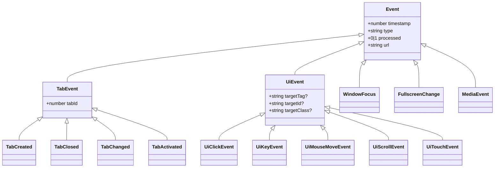

# 事件模型体系

<cite>
**本文引用的文件**
- [src/models/events/Event.ts](file://src/models/events/Event.ts)
- [src/models/events/TabEvent.ts](file://src/models/events/TabEvent.ts)
- [src/models/events/UiEvent.ts](file://src/models/events/UiEvent.ts)
- [src/models/events/WindowFocus.ts](file://src/models/events/WindowFocus.ts)
- [src/models/events/FullscreenChange.ts](file://src/models/events/FullscreenChange.ts)
- [src/models/events/MediaEvent.ts](file://src/models/events/MediaEvent.ts)
</cite>

## 目录

1. [简介](#简介)
2. [继承结构](#继承结构)
3. [子章节](#子章节)

## 简介

事件模型体系描述 BrainRest 采集到的全部事件类型。所有事件都继承自基类 `Event`，通过工厂函数 `createEvent<T>` 构造，统一携带
`timestamp`、`type`、`processed`、`url` 字段。

## 继承结构

图表来源

- [src/models/events/Event.ts](file://src/models/events/Event.ts)
- [src/models/events/TabEvent.ts](file://src/models/events/TabEvent.ts)
- [src/models/events/UiEvent.ts](file://src/models/events/UiEvent.ts)

## 子章节

- [事件基类设计](事件基类设计.md)
- [标签页事件模型](标签页事件模型.md)
- [用户界面事件模型](用户界面事件模型.md)
- [特殊事件模型](特殊事件模型.md)

**章节来源**

- [src/models/events/Event.ts](file://src/models/events/Event.ts)
