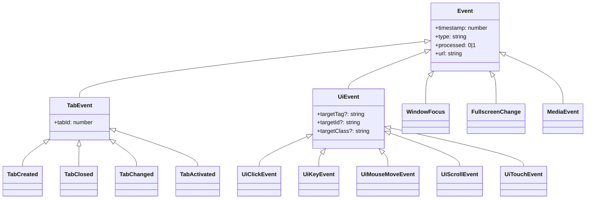

# 事件模型体系

<cite>
**本文引用的文件**
- [src/models/events/Event.ts](file://src/models/events/Event.ts)
- [src/models/events/TabEvent.ts](file://src/models/events/TabEvent.ts)
- [src/models/events/UiEvent.ts](file://src/models/events/UiEvent.ts)
- [src/models/events/WindowFocus.ts](file://src/models/events/WindowFocus.ts)
- [src/models/events/FullscreenChange.ts](file://src/models/events/FullscreenChange.ts)
- [src/models/events/MediaEvent.ts](file://src/models/events/MediaEvent.ts)
</cite>

## 目录
1. [简介](#简介)
2. [继承关系](#继承关系)
3. [事件类型清单](#事件类型清单)
4. [判别式（type）设计](#判别式type设计)
5. [子章节](#子章节)

## 简介
所有被采集的事件都实现自统一的 `Event` 基接口，并通过字符串字面量 `type` 作为判别式（discriminated union）。这套模型定义在 `src/models/events` 目录下，被内容脚本、后台监听器与疲劳引擎共享。

## 继承关系

图表来源
- [src/models/events/Event.ts](file://src/models/events/Event.ts)
- [src/models/events/TabEvent.ts](file://src/models/events/TabEvent.ts)
- [src/models/events/UiEvent.ts](file://src/models/events/UiEvent.ts)

章节来源
- [src/models/events/Event.ts](file://src/models/events/Event.ts)

## 事件类型清单
| type | 接口 | 分类 |
|------|------|------|
| `tab_created` | TabCreated | 标签页 |
| `tab_closed` | TabClosed | 标签页 |
| `tab_changed` | TabChanged | 标签页 |
| `tab_activated` | TabActivated | 标签页 |
| `click` | UiClickEvent | UI |
| `keydown` / `keyup` | UiKeyEvent | UI |
| `mousemove` | UiMouseMoveEvent | UI |
| `scroll` | UiScrollEvent | UI |
| `touchstart` / `touchend` / `touchmove` | UiTouchEvent | UI |
| `focus` / `blur` | WindowFocus | 窗口 |
| `fullscreen_change` | FullscreenChange | 特殊 |
| `media` | MediaEvent | 特殊（**未被发射**） |

章节来源
- [src/models/events/TabEvent.ts](file://src/models/events/TabEvent.ts)
- [src/models/events/UiEvent.ts](file://src/models/events/UiEvent.ts)
- [src/models/events/MediaEvent.ts](file://src/models/events/MediaEvent.ts)

## 判别式（type）设计
基接口的 `type: string` 在各子接口中被收窄为字面量（如 `'click'`、`'tab_changed'`），配合 `createEvent<T>` 工厂即可在消费侧用 `switch (event.type)` 做类型收窄。`createEvent` 自动填充 `processed: 0` 与 `timestamp: Date.now()`。

章节来源
- [src/models/events/Event.ts](file://src/models/events/Event.ts)

## 子章节
- [Event 基类设计](Event 基类设计.md)
- [标签页事件系列](标签页事件系列.md)
- [用户界面事件系列](用户界面事件系列.md)
- [窗口焦点事件](窗口焦点事件.md)
- [媒体播放事件](媒体播放事件.md)
