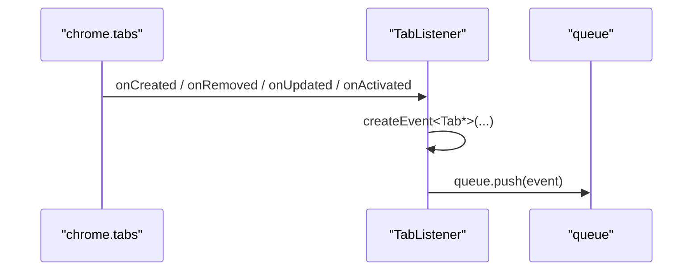

# 标签页事件系列

<cite>
**本文引用的文件**
- [src/models/events/TabEvent.ts](file://src/models/events/TabEvent.ts)
- [src/models/events/TabCreated.ts](file://src/models/events/TabCreated.ts)
- [src/models/events/TabClosed.ts](file://src/models/events/TabClosed.ts)
- [src/models/events/TabChanged.ts](file://src/models/events/TabChanged.ts)
- [src/models/events/TabActivated.ts](file://src/models/events/TabActivated.ts)
- [src/background/TabListener.ts](file://src/background/TabListener.ts)
</cite>

## 目录
1. [简介](#简介)
2. [TabEvent 基接口](#tabevent-基接口)
3. [四种标签页事件](#四种标签页事件)
4. [采集来源](#采集来源)

## 简介
标签页事件描述浏览器标签的生命周期与切换，均继承自 `TabEvent`，由后台 `TabListener` 采集并直接入队。它们是疲劳指数中“标签页切换（tabSwitch）”指标的数据来源。

## TabEvent 基接口
```ts
export interface TabEvent extends Event {
  tabId: number;   // Chrome 分配给标签页的唯一 ID
}
```
在 `Event` 基础上增加 `tabId`。

章节来源
- [src/models/events/TabEvent.ts](file://src/models/events/TabEvent.ts)

## 四种标签页事件
| type | 接口 | 特有字段 | 语义 |
|------|------|----------|------|
| `tab_created` | TabCreated | — | 新建标签页 |
| `tab_closed` | TabClosed | — | 关闭标签页 |
| `tab_changed` | TabChanged | `old_url`, `new_url` | 标签页导航到新 URL |
| `tab_activated` | TabActivated | `windowId` | 切换活动标签页 |

章节来源
- [src/models/events/TabCreated.ts](file://src/models/events/TabCreated.ts)
- [src/models/events/TabClosed.ts](file://src/models/events/TabClosed.ts)
- [src/models/events/TabChanged.ts](file://src/models/events/TabChanged.ts)
- [src/models/events/TabActivated.ts](file://src/models/events/TabActivated.ts)

## 采集来源
`TabListener` 维护一个 `Map<number, string>`（tabId → url），并注册：
- `chrome.tabs.onCreated` → `tab_created`
- `chrome.tabs.onRemoved` → `tab_closed`
- `chrome.tabs.onUpdated`（仅当 `changeInfo.url` 存在）→ `tab_changed`（带前后 URL）
- `chrome.tabs.onActivated` → `tab_activated`（带 windowId）

所有事件经 `createEvent` 构造后 `queue.push`。



图表来源
- [src/background/TabListener.ts](file://src/background/TabListener.ts)

章节来源
- [src/background/TabListener.ts](file://src/background/TabListener.ts)
