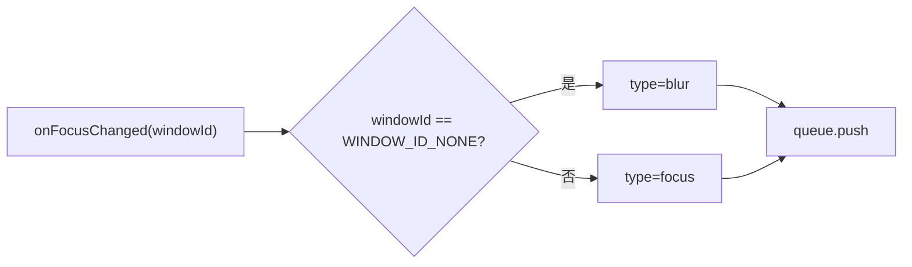

# 窗口焦点事件

<cite>
**本文引用的文件**
- [src/models/events/WindowFocus.ts](file://src/models/events/WindowFocus.ts)
- [src/background/WindowFocusListener.ts](file://src/background/WindowFocusListener.ts)
- [src/background/RuleEventDispatcher.ts](file://src/background/RuleEventDispatcher.ts)
</cite>

## 目录
1. [简介](#简介)
2. [WindowFocus 接口](#windowfocus-接口)
3. [采集来源](#采集来源)
4. [在疲劳指数中的作用](#在疲劳指数中的作用)

## 简介
窗口焦点事件记录浏览器窗口获得/失去焦点，用于判断用户是否离开浏览器（进而计入“休息权重”）。它直接继承 `Event`（非 `UiEvent`/`TabEvent`）。

## WindowFocus 接口
```ts
export interface WindowFocus extends Event {
  type: "focus" | "blur";
  windowId: number;   // 获得焦点的窗口 ID；全部失焦时为 WINDOW_ID_NONE (-1)
}
```

章节来源
- [src/models/events/WindowFocus.ts](file://src/models/events/WindowFocus.ts)

## 采集来源
`WindowFocusListener` 监听 `chrome.windows.onFocusChanged`：当 `windowId === chrome.windows.WINDOW_ID_NONE` 时发 `blur`，否则发 `focus`，并 `queue.push`。



图表来源
- [src/background/WindowFocusListener.ts](file://src/background/WindowFocusListener.ts)

章节来源
- [src/background/WindowFocusListener.ts](file://src/background/WindowFocusListener.ts)

## 在疲劳指数中的作用
`RuleEventDispatcher` 结合窗口失焦时长判断“窗口失焦”休息场景（`WINDOW_BLUR_MS = 30000`），命中时贡献较高的休息权重 R（`windowBlur: 50`），从而在融合公式中降低疲劳分。

章节来源
- [src/background/RuleEventDispatcher.ts](file://src/background/RuleEventDispatcher.ts)
