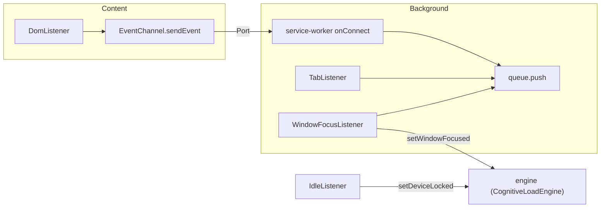

# 事件系统

<cite>
**本文引用的文件**
- [src/content/DomListener.ts](file://src/content/DomListener.ts)
- [src/content/EventChannel.ts](file://src/content/EventChannel.ts)
- [src/background/service-worker.ts](file://src/background/service-worker.ts)
- [src/background/EventQueue.ts](file://src/background/EventQueue.ts)
- [src/background/TabListener.ts](file://src/background/TabListener.ts)
- [src/background/WindowFocusListener.ts](file://src/background/WindowFocusListener.ts)
- [src/background/IdleListener.ts](file://src/background/IdleListener.ts)
- [src/models/events/Event.ts](file://src/models/events/Event.ts)
</cite>

## 目录

1. [简介](#简介)
2. [事件来源](#事件来源)
3. [传输通路](#传输通路)
4. [事件在后台的汇聚](#事件在后台的汇聚)
5. [子章节](#子章节)

## 简介

事件系统负责把用户行为转化为统一的事件对象，并送入后台的滑动窗口，供认知负荷引擎消费。它由三部分组成：内容脚本侧的采集与发送（事件通道）、后台的接收与缓存（事件队列）、以及统一的事件模型体系。

## 事件来源

- **内容脚本（页面内）**：`DomListener` 监听 mousemove（每 200ms
  采样）、click、keydown/keyup、scroll、touchstart/touchend/touchmove、fullscreenchange，用 `createEvent` 构造事件。
- **后台（浏览器级）**：`TabListener` 采集 tab_created/tab_closed/tab_changed/tab_activated；`WindowFocusListener` 采集窗口
  focus/blur；`IdleListener` 监听系统空闲/锁定状态。

图表来源

- [src/content/DomListener.ts](file://src/content/DomListener.ts)
- [src/background/TabListener.ts](file://src/background/TabListener.ts)
- [src/background/service-worker.ts](file://src/background/service-worker.ts)

章节来源

- [src/content/DomListener.ts](file://src/content/DomListener.ts)
- [src/background/TabListener.ts](file://src/background/TabListener.ts)

## 传输通路

内容脚本事件通过长连接 Port（名为 `event-stream`）传输，详见[事件通道](事件通道.md)。后台监听器无需 Port，直接调用
`queue.push`。

章节来源

- [src/content/EventChannel.ts](file://src/content/EventChannel.ts)

## 事件在后台的汇聚

所有事件最终进入单例 `queue`（`SlidingWindowQueue`），只保留最近 5 秒，详见[事件队列](事件队列.md)。认知负荷引擎每 30 秒读取该窗口计算物理信号。

章节来源

- [src/background/EventQueue.ts](file://src/background/EventQueue.ts)
- [src/background/service-worker.ts](file://src/background/service-worker.ts)

## 子章节

- [事件通道](事件通道.md)：内容脚本与后台之间的 Port 通信。
- [事件队列](事件队列.md)：5 秒滑动窗口缓存。
- [事件模型体系](事件模型体系/事件模型体系.md)：所有事件类型定义。
