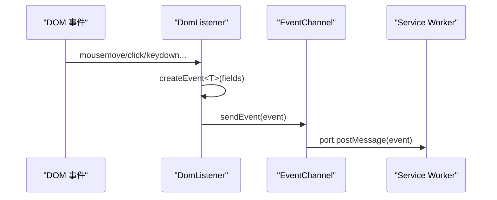

# 事件通道

<cite>
**本文引用的文件**
- [src/content/EventChannel.ts](file://src/content/EventChannel.ts)
- [src/content/DomListener.ts](file://src/content/DomListener.ts)
- [src/background/service-worker.ts](file://src/background/service-worker.ts)
- [src/models/events/Event.ts](file://src/models/events/Event.ts)
</cite>

## 目录

1. [简介](#简介)
2. [连接建立](#连接建立)
3. [发送事件](#发送事件)
4. [后台接收](#后台接收)
5. [设计说明](#设计说明)

## 简介

事件通道是内容脚本向后台上报高频 UI 事件的通路，基于 Chrome 的长连接 `chrome.runtime.Port` 实现，名称为 `event-stream`
。它只负责“单向、即发即弃”的事件投递，不做确认或重传。

## 连接建立

`EventChannel.ts` 在内容脚本加载时立即创建一个模块级 Port：

```ts
const port = chrome.runtime.connect({ name: "event-stream" });
```

该 Port 在内容脚本整个生命周期内复用，避免每个事件都新建连接的开销。

章节来源

- [src/content/EventChannel.ts](file://src/content/EventChannel.ts)

## 发送事件

模块导出唯一函数 `sendEvent(event: Event)`，内部调用 `port.postMessage(event)`。`DomListener` 中每个监听器都通过
`createEvent<T>(...)` 构造具体事件后调用 `sendEvent`。



图表来源

- [src/content/DomListener.ts](file://src/content/DomListener.ts)
- [src/content/EventChannel.ts](file://src/content/EventChannel.ts)

章节来源

- [src/content/EventChannel.ts](file://src/content/EventChannel.ts)
- [src/content/DomListener.ts](file://src/content/DomListener.ts)

## 后台接收

`service-worker.ts` 在 `chrome.runtime.onConnect` 中过滤出 `port.name === "event-stream"` 的连接，随后监听
`port.onMessage`，将收到的事件直接 `queue.push(event)` 入滑动窗口：

```ts
chrome.runtime.onConnect.addListener((port) => {
  if (port.name !== "event-stream") return;
  port.onMessage.addListener((event) => { queue.push(event); });
});
```

章节来源

- [src/background/service-worker.ts](file://src/background/service-worker.ts)

## 设计说明

- **仅用于内容脚本事件**：后台自身的 `TabListener`/`WindowFocusListener` 在同一进程内，直接 `queue.push`，不经 Port。
- **无回压/无 ACK**：事件是尽力投递；由于后台只保留 5 秒窗口，偶发丢失对疲劳统计影响有限。
- **与分类请求分离**：一次性的 `categorize` 请求走 `runtime.sendMessage`，不占用本通道。
