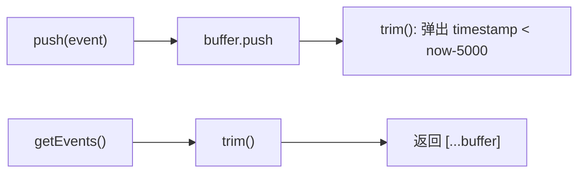

# 事件队列

<cite>
**本文引用的文件**
- [src/background/EventQueue.ts](file://src/background/EventQueue.ts)
- [src/background/service-worker.ts](file://src/background/service-worker.ts)
- [src/background/engine/CognitiveLoadEngine.ts](file://src/background/engine/CognitiveLoadEngine.ts)
- [src/models/events/Event.ts](file://src/models/events/Event.ts)
</cite>

## 目录

1. [简介](#简介)
2. [数据结构](#数据结构)
3. [核心方法](#核心方法)
4. [窗口裁剪逻辑](#窗口裁剪逻辑)
5. [与认知负荷引擎的关系](#与认知负荷引擎的关系)

## 简介

事件队列是后台的中央事件缓存，实现为一个只保留最近 5 秒事件的“滑动窗口队列”（`SlidingWindowQueue`）。它以单例 `queue`
形式导出，被所有事件生产者（Port 接收、标签页/窗口监听器）写入，被认知负荷引擎的物理信号分析器读取。它 **不做持久化**——历史事件到期即丢弃。

## 数据结构

`EventQueue.ts` 定义常量 `SLIDE_WINDOW_MS = 5000`，队列内部仅维护一个 `Event[]` 缓冲区：

```ts
class SlidingWindowQueue {
  private buffer: Event[] = [];
  // push / getEvents / trim
}
export const queue = new SlidingWindowQueue();
```

事件按到达顺序追加，因此 `buffer` 天然按 `timestamp` 升序排列。

章节来源

- [src/background/EventQueue.ts](file://src/background/EventQueue.ts)

## 核心方法

- `push(...items: Event[]): number`：追加一个或多个事件，随后调用 `trim()`，返回 push 后的长度。
- `getEvents(): Event[]`：先 `trim()`，再返回缓冲区的 **副本**（`[...buffer]`），避免调用方修改内部状态。
- `trim()`（私有）：移除过期事件。

章节来源

- [src/background/EventQueue.ts](file://src/background/EventQueue.ts)

## 窗口裁剪逻辑

`trim()` 计算 `cutoff = Date.now() - 5000`，从队首（最旧）开始移除 `timestamp < cutoff` 的事件：

```ts
private trim(): void {
  const cutoff = Date.now() - SLIDE_WINDOW_MS;
  while (this.buffer.length > 0 && this.buffer[0].timestamp < cutoff) {
    this.buffer.shift();
  }
}
```

由于缓冲区有序，只需从头部依次弹出即可，无需全量扫描。`push` 与 `getEvents` 都会触发 `trim`，保证任何一侧访问到的都是最新窗口。



图表来源

- [src/background/EventQueue.ts](file://src/background/EventQueue.ts)

章节来源

- [src/background/EventQueue.ts](file://src/background/EventQueue.ts)

## 与认知负荷引擎的关系

`CognitiveLoadEngine` 每 30 秒 `tick` 一次；计算身体疲劳 CL_phy 时，`MouseTrackAnalyzer`、`EventFrequencyAnalyzer`、`KeyboardAnalyzer` 等分析器调用 `queue.getEvents()` 拿到当前 5
秒窗口，据此计算鼠标轨迹熵、眼手延迟、交互频率、删除键占比等物理信号。窗口长度（5s）与引擎节拍（30s）共同决定了 BRI 的时间灵敏度。

章节来源

- [src/background/engine/CognitiveLoadEngine.ts](file://src/background/engine/CognitiveLoadEngine.ts)
- [src/background/service-worker.ts](file://src/background/service-worker.ts)
