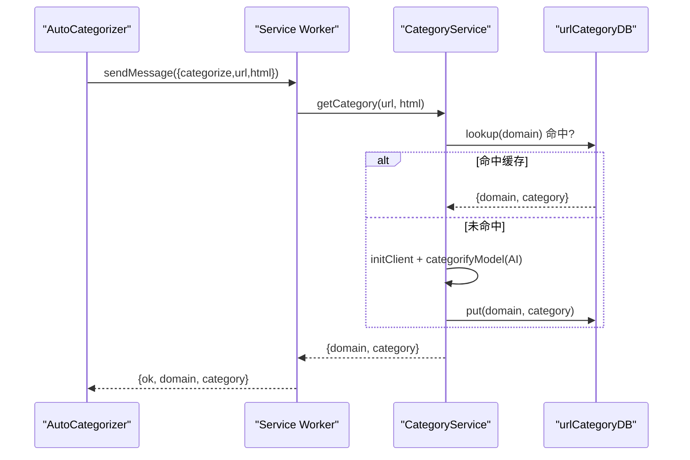

# 数据同步机制

<cite>
**本文引用的文件**
- [src/content/AutoCategorizer.ts](file://src/content/AutoCategorizer.ts)
- [src/background/service-worker.ts](file://src/background/service-worker.ts)
- [src/services/CategoryService.ts](file://src/services/CategoryService.ts)
- [src/services/UrlCategoryDataBaseManager.ts](file://src/services/UrlCategoryDataBaseManager.ts)
</cite>

## 目录
1. [简介](#简介)
2. [跨上下文同步：分类请求](#跨上下文同步分类请求)
3. [缓存优先策略](#缓存优先策略)
4. [关于“网络/多端同步”的澄清](#关于网络多端同步的澄清)

## 简介
本节说明 BrainRest 中真实存在的“同步”行为。它**不涉及服务器端或多设备同步**——所谓同步指的是内容脚本与后台之间的跨上下文数据交换，以及分类结果在本地 IndexedDB 中的缓存复用。

## 跨上下文同步：分类请求
分类能力必须在后台执行（apiKey 只在 service worker 持有）。内容脚本 `AutoCategorizer` 把 `{url, html}` 通过 `chrome.runtime.sendMessage` 交给后台；后台 `getCategory` 完成后异步 `sendResponse`（返回 `true` 保持通道）。

图表来源
- [src/content/AutoCategorizer.ts](file://src/content/AutoCategorizer.ts)
- [src/services/CategoryService.ts](file://src/services/CategoryService.ts)

章节来源
- [src/background/service-worker.ts](file://src/background/service-worker.ts)

## 缓存优先策略
`getCategory` 先 `getCategoryFromDB`（`lookup` 层级回溯）尝试命中本地缓存，命中则不调用 AI；未命中才调用模型并把结果 `put` 回库。这样同一域名只需分类一次，后续（包括 `SwitchEntropyAnalyzer` 的反查）都走缓存，既省费用又降延迟。

章节来源
- [src/services/CategoryService.ts](file://src/services/CategoryService.ts)
- [src/services/UrlCategoryDataBaseManager.ts](file://src/services/UrlCategoryDataBaseManager.ts)

## 关于“网络/多端同步”的澄清
仓库中没有任何服务器同步、账号体系或多设备数据合并逻辑。`updatedAt` 索引虽为“增量同步/批量清理”预留，但当前未被用于跨端同步。所有持久化数据均为浏览器本地存储。

章节来源
- [src/services/UrlCategoryDataBaseManager.ts](file://src/services/UrlCategoryDataBaseManager.ts)
