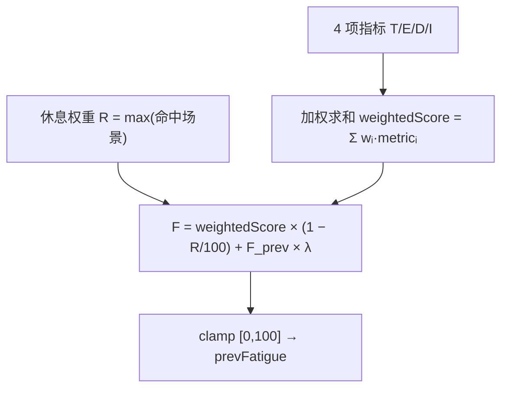

# 数据处理引擎

<cite>
**本文引用的文件**
- [src/background/RuleEventDispatcher.ts](file://src/background/RuleEventDispatcher.ts)
- [src/background/helper/TabSwitchAnalyzer.ts](file://src/background/helper/TabSwitchAnalyzer.ts)
- [src/background/helper/MouseTrackAnalyzer.ts](file://src/background/helper/MouseTrackAnalyzer.ts)
- [src/background/helper/EventFrequencyAnalyzer.ts](file://src/background/helper/EventFrequencyAnalyzer.ts)
</cite>

## 目录
1. [简介](#简介)
2. [处理节拍](#处理节拍)
3. [指标计算](#指标计算)
4. [加权与融合](#加权与融合)
5. [分级与触发](#分级与触发)

## 简介
数据处理引擎即 `RuleEventDispatcher`（单例 `dispatcher`）。它把滑动窗口内的原始事件转换为 0–100 的疲劳指数并分级。完整的算法与自学习机制见[数据分析引擎](../../核心模块/数据分析引擎.md)，本节聚焦其在数据流中的处理职责。

## 处理节拍
`start()` 后每 `TICK_MS = 1000`（1 秒）执行一次 `tick()`：读取 `queue.getEvents()`，更新跨窗口维护的活跃度/焦点/全屏状态（`updateActivityState`），再计算指标与疲劳分。节拍（1s）短于窗口（5s），保证不漏采状态。

章节来源
- [src/background/RuleEventDispatcher.ts](file://src/background/RuleEventDispatcher.ts)

## 指标计算
`computeMetrics()` 归一化 4 个指标到 0–100：
- **T tabSwitch**：`calculateTabSwitchCount()`（窗口内标签切换类事件数）× 25，封顶 100。
- **E mouseEntropy**：`calcuateMouseAnthropy()`（8 方向轨迹熵，[0,1]）× 100。
- **D eyeHandDelay**：`calculateEyeHandDelay()`（最近点击的眼手停留 ms，或 null）/ 5，封顶 100；null 记 0。
- **I eventFrequency**：`calculateEventFrequency()`（事件数/5s）× 10，封顶 100。

章节来源
- [src/background/helper/TabSwitchAnalyzer.ts](file://src/background/helper/TabSwitchAnalyzer.ts)
- [src/background/helper/MouseTrackAnalyzer.ts](file://src/background/helper/MouseTrackAnalyzer.ts)
- [src/background/helper/EventFrequencyAnalyzer.ts](file://src/background/helper/EventFrequencyAnalyzer.ts)

## 加权与融合

其中权重初始等权 0.25，可自学习；λ = `PREV_FATIGUE_DECAY` = 0.5 提供迟滞。休息权重 R 取 deviceLocked(80)/windowBlur(50)/mouseIdle(40)/videoFullscreen(30)/normal(0) 中命中场景的最大值。

图表来源
- [src/background/RuleEventDispatcher.ts](file://src/background/RuleEventDispatcher.ts)

章节来源
- [src/background/RuleEventDispatcher.ts](file://src/background/RuleEventDispatcher.ts)

## 分级与触发
`levelOf` 按阈值分级：≥90 severe、≥75 moderate、≥60 mild、否则 none。`maybeFire` 做去抖——仅当等级抬升或距上次触发超过 `REFIRE_COOLDOWN_MS`（60s）时才通知订阅者。当前唯一订阅者是 service worker 的 `console.log`。

章节来源
- [src/background/RuleEventDispatcher.ts](file://src/background/RuleEventDispatcher.ts)
