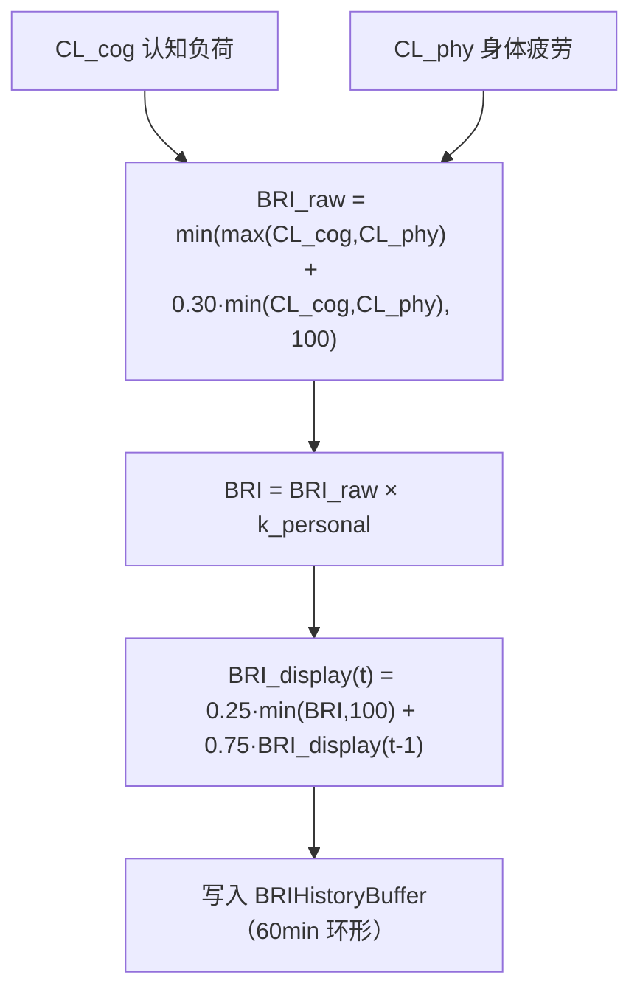

# 数据处理引擎

<cite>
**本文引用的文件**
- [src/background/engine/CognitiveLoadEngine.ts](file://src/background/engine/CognitiveLoadEngine.ts)
- [src/background/engine/CognitiveLoadCalculator.ts](file://src/background/engine/CognitiveLoadCalculator.ts)
- [src/background/engine/PhysicalFatigueCalculator.ts](file://src/background/engine/PhysicalFatigueCalculator.ts)
- [src/background/engine/TriggerEngine.ts](file://src/background/engine/TriggerEngine.ts)
- [src/background/engine/DataQualityGate.ts](file://src/background/engine/DataQualityGate.ts)
</cite>

## 目录

1. [简介](#简介)
2. [处理节拍](#处理节拍)
3. [双通道计算](#双通道计算)
4. [融合与平滑](#融合与平滑)
5. [分级与触发](#分级与触发)

## 简介

数据处理引擎即 `CognitiveLoadEngine`（单例 `engine`）。它把滑动窗口内的原始事件、页面复杂度快照与浏览器级状态转换为 0–100
的脑休息指数 BRI（Brain Rest Index）并分级。完整的算法与个人校准机制见[数据分析引擎](../../核心模块/数据分析引擎.md)，本节聚焦其在数据流中的处理职责。

## 处理节拍

`start()` 后每 `TICK_MS = 30000`（30 秒）执行一次 `tick()`：先刷新当前页面类型，再经 `DataQualityGate` 计算最近 120s 的数据覆盖率；覆盖率低于 0.70 时直接输出 `insufficient_data`，否则分别计算认知负荷 CL_cog 与身体疲劳 CL_phy，融合、校准、平滑后写入历史缓冲并评估触发。

章节来源

- [src/background/engine/CognitiveLoadEngine.ts](file://src/background/engine/CognitiveLoadEngine.ts)
- [src/background/engine/DataQualityGate.ts](file://src/background/engine/DataQualityGate.ts)

## 双通道计算

引擎并行计算两路负荷（均归一化到 0–100）：

- **认知负荷 CL_cog**（`CognitiveLoadCalculator`）：
  `CL_cog = 0.35·D + 0.15·B + 0.30·P + 0.20·T`，其中 D 为前台时长负荷、B 为标签切换负荷、P 为页面类型基线、T 为文本密度负荷。
- **身体疲劳 CL_phy**（`PhysicalFatigueCalculator`）：
  `CL_phy = [(0.30·E + 0.20·L + 0.25·I + 0.25·R) / 100] × (1 − R_rest/100) × 100`，其中 E 为鼠标轨迹熵、L 为眼手延迟、I 为交互频率、R 为删除键占比；R_rest 为休息权重。

章节来源

- [src/background/engine/CognitiveLoadCalculator.ts](file://src/background/engine/CognitiveLoadCalculator.ts)
- [src/background/engine/PhysicalFatigueCalculator.ts](file://src/background/engine/PhysicalFatigueCalculator.ts)

## 融合与平滑

融合取两通道的较大者加上较小者的 30%，避免单通道饱和；随后乘个人校准系数 `k_personal`（0.5–1.5），再经一阶低通（α = 0.25）平滑输出 `BRI_display`。休息权重 R_rest 取 deviceLocked (80)/windowBlur (50)/mouseIdle (40)/videoFullscreen (30)/normal (0) 中命中场景的最大值。

图表来源

- [src/background/engine/CognitiveLoadEngine.ts](file://src/background/engine/CognitiveLoadEngine.ts)

章节来源

- [src/background/engine/CognitiveLoadEngine.ts](file://src/background/engine/CognitiveLoadEngine.ts)

## 分级与触发

平滑后的 BRI 按阈值分级：≥70 `high`、≥40 `moderate`、否则 `low`（数据不足记 `insufficient_data`）。`TriggerEngine` 在硬门槛（前台≥30min、数据新鲜<120s、覆盖率≥0.70、冷却≥30min）通过后评估三条路径 A/B/C，命中结果写入 `BRIResult.triggerPath`。引擎本身不执行任何 UI 操作，是否提醒由前端读取结果后决定。

章节来源

- [src/background/engine/TriggerEngine.ts](file://src/background/engine/TriggerEngine.ts)
- [src/background/engine/CognitiveLoadEngine.ts](file://src/background/engine/CognitiveLoadEngine.ts)
