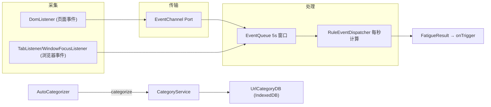

# 数据流设计

<cite>
**本文引用的文件**
- [src/content/DomListener.ts](file://src/content/DomListener.ts)
- [src/content/EventChannel.ts](file://src/content/EventChannel.ts)
- [src/background/service-worker.ts](file://src/background/service-worker.ts)
- [src/background/EventQueue.ts](file://src/background/EventQueue.ts)
- [src/background/RuleEventDispatcher.ts](file://src/background/RuleEventDispatcher.ts)
- [src/services/UrlCategoryDataBaseManager.ts](file://src/services/UrlCategoryDataBaseManager.ts)
</cite>

## 目录
1. [简介](#简介)
2. [整体数据流](#整体数据流)
3. [四个阶段](#四个阶段)
4. [两条数据流对比](#两条数据流对比)
5. [子章节](#子章节)

## 简介
BrainRest 的数据流围绕“事件”与“分类”两类数据展开。事件从页面/浏览器采集，进入 5 秒滑动窗口，被疲劳引擎实时消费；分类数据由 AI 生成后写入 IndexedDB，供反查复用。本文描述真实的数据流转，而非通用的“采集-清洗-入库-同步”管线。

## 整体数据流

图表来源
- [src/content/DomListener.ts](file://src/content/DomListener.ts)
- [src/background/EventQueue.ts](file://src/background/EventQueue.ts)
- [src/background/RuleEventDispatcher.ts](file://src/background/RuleEventDispatcher.ts)

章节来源
- [src/background/service-worker.ts](file://src/background/service-worker.ts)

## 四个阶段
1. **采集**：内容脚本采集 UI 事件；后台监听器采集标签页/窗口/空闲事件。见[数据采集层](数据采集层.md)。
2. **传输/缓冲**：UI 事件经 Port 上报，统一写入滑动窗口 `queue`。见[数据存储管理](数据存储管理.md)。
3. **处理**：`RuleEventDispatcher` 每秒读取窗口，计算疲劳指数。见[数据处理引擎](数据处理引擎.md)。
4. **复用/同步**：分类结果落 IndexedDB，供后续 `lookup` 命中缓存。见[数据同步机制](数据同步机制.md)。

## 两条数据流对比
| 维度 | 事件流 | 分类流 |
|------|--------|--------|
| 触发 | 用户交互 / 浏览器事件 | 页面加载后 3s |
| 通道 | Port `event-stream` | `runtime.sendMessage` |
| 落地 | 内存 5s 滑动窗口 | IndexedDB 持久缓存 |
| 消费者 | 疲劳引擎 | 分类反查（如 SwitchEntropyAnalyzer） |

章节来源
- [src/background/service-worker.ts](file://src/background/service-worker.ts)

## 子章节
- [数据采集层](数据采集层.md)
- [数据处理引擎](数据处理引擎.md)
- [数据存储管理](数据存储管理.md)
- [数据同步机制](数据同步机制.md)
