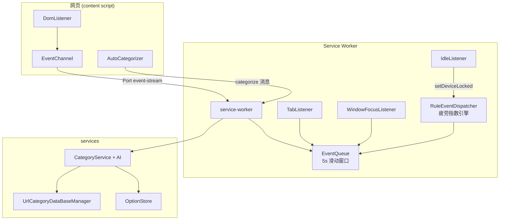

# 架构设计

<cite>
**本文引用的文件**
- [src/manifest.ts](file://src/manifest.ts)
- [src/content/index.ts](file://src/content/index.ts)
- [src/content/EventChannel.ts](file://src/content/EventChannel.ts)
- [src/content/DomListener.ts](file://src/content/DomListener.ts)
- [src/content/AutoCategorizer.ts](file://src/content/AutoCategorizer.ts)
- [src/background/service-worker.ts](file://src/background/service-worker.ts)
- [src/background/EventQueue.ts](file://src/background/EventQueue.ts)
- [src/background/RuleEventDispatcher.ts](file://src/background/RuleEventDispatcher.ts)
- [src/services/CategoryService.ts](file://src/services/CategoryService.ts)
</cite>

## 目录
1. [简介](#简介)
2. [架构分层](#架构分层)
3. [组件视图](#组件视图)
4. [两条运行时通路](#两条运行时通路)
5. [疲劳指数引擎](#疲劳指数引擎)
6. [设计取舍](#设计取舍)
7. [实现状态](#实现状态)

## 简介
BrainRest 是一个 Chrome Manifest V3 扩展，目标是识别用户的“认知疲劳”并适时提醒休息。整体遵循 MV3 的三段式结构：**内容脚本（采集）→ 后台 service worker（处理）→ 服务层（能力）**。后台核心是一个每秒运行的疲劳指数引擎，读取近 5 秒事件窗口计算加权疲劳分。本文描述真实代码中的架构。

## 架构分层
- **采集层（content）**：`DomListener` 监听页面 UI 事件；`EventChannel` 通过长连接 Port 上报；`AutoCategorizer` 发起页面分类请求。
- **处理层（background）**：`service-worker` 接收 Port 事件入队；`RuleEventDispatcher` 定时计算疲劳指数；`TabListener`/`WindowFocusListener`/`IdleListener` 采集浏览器级事件。
- **能力层（services）**：`CategoryService` + `AI` 做 URL 分类，`UrlCategoryDataBaseManager` 缓存分类，`OptionStore` 管理配置。
- **模型层（models）**：事件模型、`Option`、类型定义。
- **界面层（popup）**：React 占位 UI（未启用）。

## 组件视图

图表来源
- [src/content/DomListener.ts](file://src/content/DomListener.ts)
- [src/content/EventChannel.ts](file://src/content/EventChannel.ts)
- [src/background/service-worker.ts](file://src/background/service-worker.ts)
- [src/background/RuleEventDispatcher.ts](file://src/background/RuleEventDispatcher.ts)

章节来源
- [src/manifest.ts](file://src/manifest.ts)
- [src/background/service-worker.ts](file://src/background/service-worker.ts)

## 两条运行时通路
1. **事件流**：内容脚本用 `chrome.runtime.connect({ name: "event-stream" })` 建立 Port，UI 事件经 `port.postMessage` 上报；后台 `onConnect` 回调里 `queue.push(event)`。后台监听器直接入队浏览器事件。
2. **分类请求**：`AutoCategorizer` 用 `chrome.runtime.sendMessage({ type: "categorize", url, html })`；后台 `onMessage` 校验后调用 `getCategory` 并异步 `sendResponse`（返回 `true` 保持通道）。

章节来源
- [src/content/EventChannel.ts](file://src/content/EventChannel.ts)
- [src/background/service-worker.ts](file://src/background/service-worker.ts)
- [src/content/AutoCategorizer.ts](file://src/content/AutoCategorizer.ts)

## 疲劳指数引擎
`RuleEventDispatcher` 是单例 `dispatcher`：`start()` 后每秒 `tick`，从 `queue.getEvents()` 取 5s 窗口，计算 4 个归一化指标（tabSwitch、mouseEntropy、eyeHandDelay、eventFrequency），与自学习权重加权求和，再按 `F = weightedScore × (1 − R/100) + F_prev × λ` 融合“休息权重 R”与上次疲劳衰减 λ，分级 none/mild/moderate/severe（阈值 60/75/90）。详见[疲劳指数计算](../核心模块/数据分析引擎.md)。

章节来源
- [src/background/RuleEventDispatcher.ts](file://src/background/RuleEventDispatcher.ts)

## 设计取舍
- **滑动窗口而非全量持久化**：`EventQueue` 只保留最近 5 秒事件，内存开销小，契合疲劳“即时性”需求；`EventDataBaseManager`（IndexedDB 事件库）已实现但当前未接入。
- **Port 与一次性消息分离**：高频事件走长连接 Port，低频分类走 `sendMessage`，职责清晰。
- **权重自学习**：疲劳权重根据用户反馈调整并持久化到 `chrome.storage.local`。

## 实现状态
- ✅ 事件采集、滑动窗口、疲劳指数计算、URL 分类均已实现。
- ⚠️ 疲劳触发目前仅 `console.log`，无提醒 UI；popup 未启用。
- ❌ 事件持久化库、`MediaEvent`、`TimeData`、`InteractionMetrics` 等未接入主流程。

章节来源
- [src/background/service-worker.ts](file://src/background/service-worker.ts)
- [src/manifest.ts](file://src/manifest.ts)
