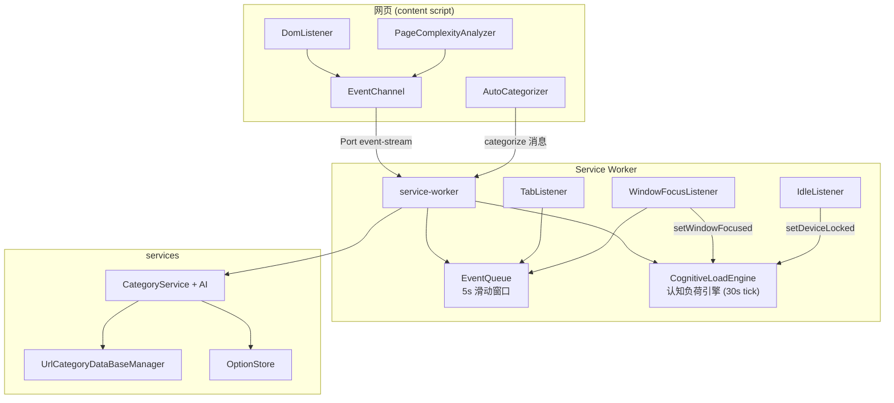

# 架构设计

<cite>
**本文引用的文件**
- [src/manifest.ts](file://src/manifest.ts)
- [src/content/index.ts](file://src/content/index.ts)
- [src/content/EventChannel.ts](file://src/content/EventChannel.ts)
- [src/content/DomListener.ts](file://src/content/DomListener.ts)
- [src/content/AutoCategorizer.ts](file://src/content/AutoCategorizer.ts)
- [src/content/PageComplexityAnalyzer.ts](file://src/content/PageComplexityAnalyzer.ts)
- [src/background/service-worker.ts](file://src/background/service-worker.ts)
- [src/background/EventQueue.ts](file://src/background/EventQueue.ts)
- [src/background/engine/CognitiveLoadEngine.ts](file://src/background/engine/CognitiveLoadEngine.ts)
- [src/services/CategoryService.ts](file://src/services/CategoryService.ts)
</cite>

## 目录

1. [简介](#简介)
2. [架构分层](#架构分层)
3. [组件视图](#组件视图)
4. [两条运行时通路](#两条运行时通路)
5. [认知负荷引擎](#认知负荷引擎)
6. [设计取舍](#设计取舍)
7. [实现状态](#实现状态)

## 简介

BrainRest 是一个 Chrome Manifest V3 扩展，目标是识别用户的"认知疲劳"并适时提醒休息。整体遵循 MV3 的三段式结构： **内容脚本（采集）→
后台 service worker（处理）→ 服务层（能力）**。后台核心是一个每 30 秒运行的认知负荷引擎，融合认知负荷（CL_cog）与身体疲劳（CL_phy）输出脑休息指数 BRI。本文描述真实代码中的架构。

## 架构分层

- **采集层（content）**：`DomListener` 监听页面 UI 事件；`PageComplexityAnalyzer` 每 30s 采样页面复杂度；`EventChannel` 通过长连接 Port 上报；`AutoCategorizer` 发起页面分类请求。
- **处理层（background）**：`service-worker` 接收 Port 事件入队并转发引擎；`CognitiveLoadEngine`（`engine/`）定时计算 BRI；`TabListener`/
  `WindowFocusListener`/`IdleListener` 采集浏览器级事件。
- **能力层（services）**：`CategoryService` + `AI` 做 URL 分类，`UrlCategoryDataBaseManager` 缓存分类，`OptionStore` 管理配置。
- **模型层（models）**：事件模型、`Option`、类型定义。
- **界面层（popup）**：React 占位 UI（未启用）。

## 组件视图

图表来源

- [src/content/DomListener.ts](file://src/content/DomListener.ts)
- [src/content/EventChannel.ts](file://src/content/EventChannel.ts)
- [src/background/service-worker.ts](file://src/background/service-worker.ts)
- [src/background/engine/CognitiveLoadEngine.ts](file://src/background/engine/CognitiveLoadEngine.ts)

章节来源

- [src/manifest.ts](file://src/manifest.ts)
- [src/background/service-worker.ts](file://src/background/service-worker.ts)

## 两条运行时通路

1. **事件流**：内容脚本用 `chrome.runtime.connect({ name: "event-stream" })` 建立 Port，UI 事件与页面复杂度事件经 `port.postMessage` 上报；后台
   `onConnect` 回调里按类型分流：`page_complexity` 转发引擎、`tab_activated` 写入 TabEventBuffer、所有事件入队并转发引擎。后台监听器直接入队浏览器事件。
2. **分类请求**：`AutoCategorizer` 用 `chrome.runtime.sendMessage({ type: "categorize", url, html })`；后台 `onMessage`
   校验后调用 `getCategory` 并异步 `sendResponse`（返回 `true` 保持通道）。

章节来源

- [src/content/EventChannel.ts](file://src/content/EventChannel.ts)
- [src/background/service-worker.ts](file://src/background/service-worker.ts)
- [src/content/AutoCategorizer.ts](file://src/content/AutoCategorizer.ts)

## 认知负荷引擎

`CognitiveLoadEngine` 是单例 `engine`：`start()` 后每 30s `tick`，计算认知负荷 CL_cog（时长 + 页面类型 + 复杂度 + 切换负荷）与身体疲劳 CL_phy（轨迹熵 + 眼手延迟 + 交互频率 + 删除键占比），融合为
`BRI_raw = max(CL_cog, CL_phy) + 0.30 × min(CL_cog, CL_phy)`，经个人校准 k_personal 和一阶低通平滑输出 BRI_display（0-100），分级 low/moderate/high（阈值
40/70）。TriggerEngine 评估三条触发路径（A/B/C），命中结果附在 BRIResult.triggerPath 中，如何响应由前端决定。详见[数据分析引擎](../核心模块/数据分析引擎.md)。

章节来源

- [src/background/engine/CognitiveLoadEngine.ts](file://src/background/engine/CognitiveLoadEngine.ts)

## 设计取舍

- **滑动窗口而非全量持久化**：`EventQueue` 只保留最近 5 秒事件，内存开销小，供 helper 分析器即时计算物理信号；`EventDataBaseManager`
  （IndexedDB 事件库）已实现但当前未接入。
- **Port 与一次性消息分离**：高频事件走长连接 Port，低频分类走 `sendMessage`，职责清晰。
- **纯计算引擎**：引擎只输出 BRIResult（含 triggerPath），不执行任何 UI 操作，前端决策与计算解耦。
- **个人校准**：k_personal 根据用户行为在线学习并持久化到 `chrome.storage.local`。

## 实现状态

- ✅ 事件采集、滑动窗口、认知负荷引擎（CL_cog + CL_phy → BRI）、触发路径评估、个人校准、数据质量门控、URL 分类均已实现。
- ⚠️ 事件持久化库已定义但未接入；popup 未启用。
- ❌ BRI 触发后的提醒 UI 尚未实现（引擎仅输出 triggerPath）。

章节来源

- [src/background/service-worker.ts](file://src/background/service-worker.ts)
- [src/manifest.ts](file://src/manifest.ts)
