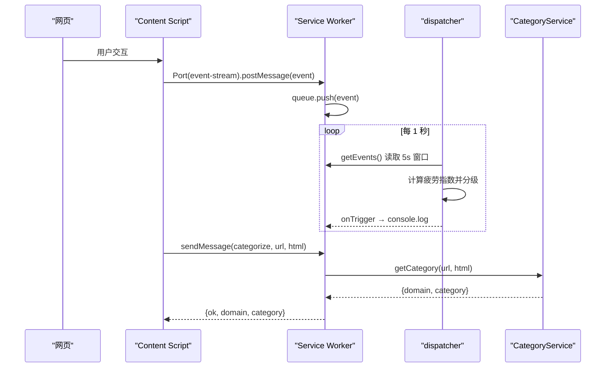

# 系统概览

<cite>
**本文引用的文件**
- [README.md](file://README.md)
- [src/manifest.ts](file://src/manifest.ts)
- [src/content/index.ts](file://src/content/index.ts)
- [src/background/service-worker.ts](file://src/background/service-worker.ts)
- [src/background/RuleEventDispatcher.ts](file://src/background/RuleEventDispatcher.ts)
- [src/services/CategoryService.ts](file://src/services/CategoryService.ts)
</cite>

## 目录
1. [系统定位](#系统定位)
2. [能力清单](#能力清单)
3. [端到端时序](#端到端时序)
4. [权限与宿主](#权限与宿主)
5. [模块地图](#模块地图)

## 系统定位
BrainRest（“Train your brain to rest better!”）是一个 Chrome MV3 扩展，通过监测用户在浏览器中的交互行为，实时估算“认知疲劳指数”，并在疲劳超过阈值时提醒用户休息。同时它能对访问的网站做 AI 分类，为疲劳分析提供上下文。

## 能力清单
- **事件采集**：鼠标移动/点击、键盘、滚动、触摸、全屏切换（内容脚本）；标签页创建/关闭/切换/激活、窗口焦点、系统空闲（后台）。
- **疲劳指数**：每秒基于 5 秒窗口计算 4 项归一化指标并加权融合，输出 0–100 分与分级。
- **URL 分类**：调用 OpenAI/DeepSeek 兼容接口把域名归入 11 类，并用 IndexedDB 缓存。
- **配置管理**：AI Provider / 模型 / API Key 存于 `chrome.storage.local`。

## 端到端时序

图表来源
- [src/content/index.ts](file://src/content/index.ts)
- [src/background/service-worker.ts](file://src/background/service-worker.ts)
- [src/background/RuleEventDispatcher.ts](file://src/background/RuleEventDispatcher.ts)

章节来源
- [src/background/service-worker.ts](file://src/background/service-worker.ts)

## 权限与宿主
`manifest.ts` 声明 `permissions: ["tabs", "windows", "storage", "idle"]`，`host_permissions` 覆盖 `api.openai.com` 与 `api.deepseek.com`（供后台调用 AI）。内容脚本注入范围为 `<all_urls>`，后台为 module 类型 service worker。

章节来源
- [src/manifest.ts](file://src/manifest.ts)

## 模块地图
- `content/`：`index`、`DomListener`、`EventChannel`、`AutoCategorizer`
- `background/`：`service-worker`、`EventQueue`、`RuleEventDispatcher`、`TabListener`、`WindowFocusListener`、`IdleListener`、`helper/*`
- `services/`：`AI`、`CategoryService`、`OptionStore`、`UrlCategoryDataBaseManager`、`EventDataBaseManager`（未接入）
- `models/`：`events/*`、`Option`、`types`、`TimeData`（未接入）
- `popup/`：`App`、`main`（占位，未启用）

章节来源
- [README.md](file://README.md)
- [src/manifest.ts](file://src/manifest.ts)
