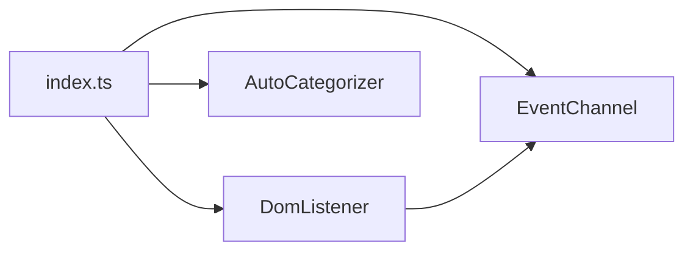

# 内容脚本架构

<cite>
**本文引用的文件**
- [src/content/index.ts](file://src/content/index.ts)
- [src/content/EventChannel.ts](file://src/content/EventChannel.ts)
- [src/content/DomListener.ts](file://src/content/DomListener.ts)
- [src/content/AutoCategorizer.ts](file://src/content/AutoCategorizer.ts)
- [src/manifest.ts](file://src/manifest.ts)
</cite>

## 目录
1. [简介](#简介)
2. [注入方式](#注入方式)
3. [模块组成](#模块组成)
4. [初始化流程](#初始化流程)
5. [子章节](#子章节)

## 简介
内容脚本运行在每个匹配页面的隔离环境中，负责采集页面内交互并触发页面分类。它由三个纯副作用模块组成，通过 `index.ts` 一次性导入完成注册。

## 注入方式
`manifest.ts` 声明 `content_scripts` 匹配 `<all_urls>`，入口为 `src/content/index.ts`；`vite.config.ts` 将其列入 `standaloneFiles` 独立打包。

章节来源
- [src/manifest.ts](file://src/manifest.ts)
- [src/content/index.ts](file://src/content/index.ts)

## 模块组成
- **EventChannel**：创建名为 `event-stream` 的长连接 Port，导出 `sendEvent`。
- **DomListener**：注册各类 DOM 事件监听器，用 `createEvent` 构造并 `sendEvent`。
- **AutoCategorizer**：页面加载 3s 后发起 `categorize` 请求。

图表来源
- [src/content/index.ts](file://src/content/index.ts)
- [src/content/DomListener.ts](file://src/content/DomListener.ts)

章节来源
- [src/content/index.ts](file://src/content/index.ts)

## 初始化流程
`index.ts` 仅有三行 `import`：导入 `EventChannel`（建立 Port）、`DomListener`（注册监听）、`AutoCategorizer`（挂载 load 回调）。三个模块均在导入时通过顶层副作用完成初始化，没有显式的 init 函数。

章节来源
- [src/content/index.ts](file://src/content/index.ts)
- [src/content/EventChannel.ts](file://src/content/EventChannel.ts)

## 子章节
- [自动分类器](自动分类器.md)
- 事件通道与 DOM 监听详见[事件通道](../../事件系统/事件通道.md)与[内容脚本模块](../../../核心模块/内容脚本模块.md)。
