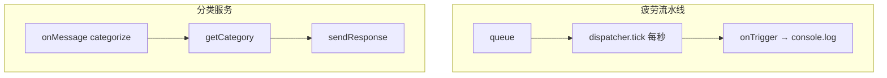

# 后台服务架构

<cite>
**本文引用的文件**
- [src/background/service-worker.ts](file://src/background/service-worker.ts)
- [src/background/EventQueue.ts](file://src/background/EventQueue.ts)
- [src/background/RuleEventDispatcher.ts](file://src/background/RuleEventDispatcher.ts)
- [src/background/TabListener.ts](file://src/background/TabListener.ts)
- [src/background/WindowFocusListener.ts](file://src/background/WindowFocusListener.ts)
- [src/background/IdleListener.ts](file://src/background/IdleListener.ts)
</cite>

## 目录
1. [简介](#简介)
2. [入口 service-worker](#入口-service-worker)
3. [组件构成](#组件构成)
4. [两类职责](#两类职责)
5. [子章节](#子章节)

## 简介
后台运行在 MV3 的 module 类型 service worker 中，是扩展的处理中枢：既维护事件队列与疲劳指数引擎，又充当分类请求的执行者。

## 入口 service-worker
`service-worker.ts` 在加载时：
1. `import` 三个监听器（副作用注册 `TabListener`/`WindowFocusListener`/`IdleListener`）。
2. `dispatcher.start()` 启动每秒疲劳计算，并 `onTrigger` 打印结果。
3. 注册 `onConnect`：过滤 `event-stream` Port，把事件 `queue.push`。
4. 注册 `onMessage`：校验 `categorize` 请求并异步 `getCategory` 后 `sendResponse`。

章节来源
- [src/background/service-worker.ts](file://src/background/service-worker.ts)

## 组件构成
| 组件 | 形态 | 职责 |
|------|------|------|
| `EventQueue` | 单例 `queue` | 5s 滑动窗口缓存事件 |
| `RuleEventDispatcher` | 单例 `dispatcher` | 每秒计算疲劳指数 |
| `TabListener` | 模块级监听 | 采集标签页事件 |
| `WindowFocusListener` | 模块级监听 | 采集窗口焦点事件 |
| `IdleListener` | 模块级监听 | 注入锁屏状态 |
| `helper/*` | 纯函数 | 指标计算 |

> 说明：三个监听器是**模块级 `chrome.*.addListener` 注册**，而非类实例。

章节来源
- [src/background/TabListener.ts](file://src/background/TabListener.ts)
- [src/background/WindowFocusListener.ts](file://src/background/WindowFocusListener.ts)
- [src/background/IdleListener.ts](file://src/background/IdleListener.ts)

## 两类职责

图表来源
- [src/background/service-worker.ts](file://src/background/service-worker.ts)
- [src/background/RuleEventDispatcher.ts](file://src/background/RuleEventDispatcher.ts)

章节来源
- [src/background/service-worker.ts](file://src/background/service-worker.ts)

## 子章节
- [规则事件分发器](规则事件分发器.md)
- 后台整体见[背景服务模块](../../../核心模块/背景服务模块.md)。
