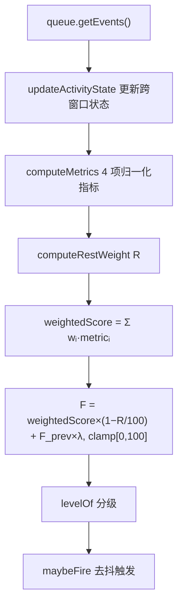

# 规则事件分发器

<cite>
**本文引用的文件**
- [src/background/RuleEventDispatcher.ts](file://src/background/RuleEventDispatcher.ts)
- [src/background/EventQueue.ts](file://src/background/EventQueue.ts)
- [src/background/IdleListener.ts](file://src/background/IdleListener.ts)
- [src/background/helper/TabSwitchAnalyzer.ts](file://src/background/helper/TabSwitchAnalyzer.ts)
- [src/background/helper/MouseTrackAnalyzer.ts](file://src/background/helper/MouseTrackAnalyzer.ts)
- [src/background/helper/EventFrequencyAnalyzer.ts](file://src/background/helper/EventFrequencyAnalyzer.ts)
</cite>

## 目录
1. [简介](#简介)
2. [单例与状态](#单例与状态)
3. [tick 主循环](#tick-主循环)
4. [休息权重 R](#休息权重-r)
5. [触发去抖](#触发去抖)
6. [权重自学习与持久化](#权重自学习与持久化)
7. [公开 API](#公开-api)

## 简介
`RuleEventDispatcher` 是 BrainRest 的疲劳指数引擎，也是后台的核心组件。**它不是通用的“事件过滤/分类/路由/持久化”管线**，而是一个专门把交互事件转换为疲劳指数并触发提醒的定时计算器，以单例 `dispatcher` 导出。

## 单例与状态
私有构造 + `getInstance()` 单例。关键实例状态：
- `weights`：4 项指标权重，初始等权 0.25，和为 1。
- `prevFatigue`：上一周期疲劳值，用于迟滞。
- `lastResult` / `lastTriggerMetrics`：最近结果与触发快照。
- 跨窗口状态：`lastActivityAt`、`isFocused`、`lastBlurAt`、`videoFullscreen`、`deviceLocked`。
- 去抖：`lastFiredRank`、`lastFiredAt`。

章节来源
- [src/background/RuleEventDispatcher.ts](file://src/background/RuleEventDispatcher.ts)

## tick 主循环
`start()` 用 `setInterval` 每 `TICK_MS = 1000` 执行 `tick()`：

指标归一化：tabSwitch=切换数×25；mouseEntropy=熵×100；eyeHandDelay=延迟/5（null→0）；eventFrequency=(事件数/5s)×10；均封顶 100。

图表来源
- [src/background/RuleEventDispatcher.ts](file://src/background/RuleEventDispatcher.ts)
- [src/background/helper/TabSwitchAnalyzer.ts](file://src/background/helper/TabSwitchAnalyzer.ts)

章节来源
- [src/background/RuleEventDispatcher.ts](file://src/background/RuleEventDispatcher.ts)

## 休息权重 R
`computeRestWeight()` 取所有命中场景中的最大值：`deviceLocked=80`（直接返回）、`windowBlur=50`（失焦超 30s）、`mouseIdle=40`（无交互超 20s）、`videoFullscreen=30`、`normal=0`。R 越高，`(1 − R/100)` 越小，疲劳分被抑制得越多——即“被动/休息”状态不判为疲劳。

`updateActivityState` 依据窗口内事件更新 `lastActivityAt`（最新交互时间）、焦点状态（最新 focus/blur）、全屏状态（最新 fullscreen_change）。锁屏状态由 `IdleListener` 通过 `setDeviceLocked` 注入。

章节来源
- [src/background/RuleEventDispatcher.ts](file://src/background/RuleEventDispatcher.ts)
- [src/background/IdleListener.ts](file://src/background/IdleListener.ts)

## 触发去抖
`maybeFire()`：level 为 none 时重置 `lastFiredRank`；否则仅当**等级抬升**或**距上次触发超过 `REFIRE_COOLDOWN_MS`（60s）**才通知订阅者。单个订阅者异常被 `try/catch` 吞掉，不影响其它订阅者。

章节来源
- [src/background/RuleEventDispatcher.ts](file://src/background/RuleEventDispatcher.ts)

## 权重自学习与持久化
`recordFeedback(agree)` 用最近触发时的指标快照调整权重：
- 认同（agree=true）：`wᵢ += lr · (vᵢ/100) · (1 − wᵢ)`
- 拒绝（agree=false）：`wᵢ -= lr · (vᵢ/100) · wᵢ`

其中 `lr = LEARNING_RATE = 0.05`。随后 `normalizeWeights` 归一化并 `saveWeights` 写入 `chrome.storage.local`（键 `brainrest_fatigue_weights`）。构造时 `loadWeights` 读取已保存权重。

章节来源
- [src/background/RuleEventDispatcher.ts](file://src/background/RuleEventDispatcher.ts)

## 公开 API
| 方法 | 说明 |
|------|------|
| `start()` / `stop()` | 启停每秒计算循环 |
| `onTrigger(cb)` | 订阅触发，返回取消订阅函数 |
| `getLastResult()` | 读取最近一次 `FatigueResult` |
| `getWeights()` | 读取当前权重副本 |
| `setVideoFullscreen(b)` | 注入视频全屏状态 |
| `setDeviceLocked(b)` | 注入锁屏状态 |
| `recordFeedback(agree)` | 提交用户反馈以自学习 |

章节来源
- [src/background/RuleEventDispatcher.ts](file://src/background/RuleEventDispatcher.ts)
