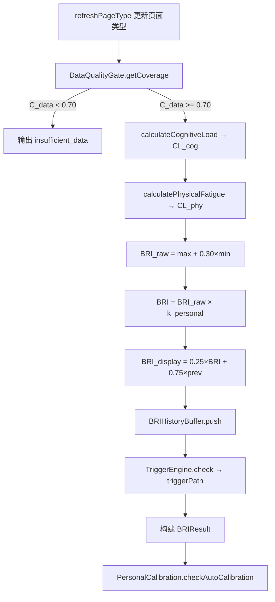

# 认知负荷引擎

<cite>
**本文引用的文件**
- [src/background/engine/CognitiveLoadEngine.ts](file://src/background/engine/CognitiveLoadEngine.ts)
- [src/background/engine/CognitiveLoadCalculator.ts](file://src/background/engine/CognitiveLoadCalculator.ts)
- [src/background/engine/PhysicalFatigueCalculator.ts](file://src/background/engine/PhysicalFatigueCalculator.ts)
- [src/background/engine/TriggerEngine.ts](file://src/background/engine/TriggerEngine.ts)
- [src/background/engine/SessionTracker.ts](file://src/background/engine/SessionTracker.ts)
- [src/background/engine/DataQualityGate.ts](file://src/background/engine/DataQualityGate.ts)
- [src/background/engine/BRIHistoryBuffer.ts](file://src/background/engine/BRIHistoryBuffer.ts)
- [src/background/engine/TabEventBuffer.ts](file://src/background/engine/TabEventBuffer.ts)
- [src/background/engine/PersonalCalibration.ts](file://src/background/engine/PersonalCalibration.ts)
- [src/background/engine/types.ts](file://src/background/engine/types.ts)
- [src/background/EventQueue.ts](file://src/background/EventQueue.ts)
- [src/background/IdleListener.ts](file://src/background/IdleListener.ts)
</cite>

## 目录

1. [简介](#简介)
2. [单例与状态](#单例与状态)
3. [tick 主循环](#tick-主循环)
4. [认知负荷 CL_cog](#认知负荷-cl_cog)
5. [身体疲劳 CL_phy](#身体疲劳-cl_phy)
6. [BRI 融合与平滑](#bri-融合与平滑)
7. [触发路径评估](#触发路径评估)
8. [个人校准](#个人校准)
9. [公开 API](#公开-api)

## 简介

`CognitiveLoadEngine` 是 BrainRest 的认知负荷引擎，也是后台的核心组件。它是一个**纯计算引擎**——每 30 秒 tick 一次，持续输出 `BRIResult`（含 `triggerPath`），如何响应（提醒、弹窗等）由前端决定。以单例 `engine` 导出。

## 单例与状态

私有构造 + `getInstance()` 单例。关键实例状态：

- `prevBriDisplay`：上一周期的 BRI_display，用于平滑。
- `lastResult`：最近一次 `BRIResult`。
- `latestComplexity`：最新的页面复杂度快照。
- `currentUrl` / `currentPageType`：当前活跃标签页 URL 与页面类型缓存。
- 活跃度/休息状态：`lastActivityAt`、`isFocused`、`lastBlurAt`、`videoFullscreen`、`deviceLocked`。

章节来源

- [src/background/engine/CognitiveLoadEngine.ts](file://src/background/engine/CognitiveLoadEngine.ts)

## tick 主循环

`start()` 用 `setInterval` 每 `TICK_MS = 30000` 执行 `tick()`：

章节来源

- [src/background/engine/CognitiveLoadEngine.ts](file://src/background/engine/CognitiveLoadEngine.ts#L194-L286)

## 认知负荷 CL_cog

`CL_cog = 0.35·D + 0.15·B + 0.30·P + 0.20·T`

- **D 时长得分**：`min(t_front / 60 × 100, 100)`，来自 SessionTracker。
- **B 页面类型基线**：查 `TYPE_BASELINE` 表（11 类 UrlCategory → 35-90 分），未知类型取 50。
- **P 页面综合复杂度**：`0.70·ρ + 0.30·S`（ρ = 文字密度得分，S = 结构复杂度得分）。
- **T 切换负荷**：`min(N_switch × 12.5 + N_load × 7.5, 100)`，来自 TabEventBuffer（5min 窗口）。

章节来源

- [src/background/engine/CognitiveLoadCalculator.ts](file://src/background/engine/CognitiveLoadCalculator.ts)

## 身体疲劳 CL_phy

`CL_phy = [(0.30·E + 0.20·L + 0.25·I + 0.25·R) / 100] × (1 - R_rest/100) × 100`

- **E 轨迹熵**：8 方向香农熵 / 3bit × 100（MouseTrackAnalyzer）。
- **L 眼-手延迟**：`min(τ / 500ms × 100, 100)`，无有效点击记 0。
- **I 交互强度**：`min(freq / 10s⁻¹ × 100, 100)`（EventFrequencyAnalyzer）。
- **R 修正负荷**：删除键占比 × 100（KeyboardAnalyzer）。
- **R_rest 休息衰减因子**（取命中场景最大值）：`deviceLocked=80`、`windowBlur=50`（失焦超 30s）、`mouseIdle=40`（无交互超 20s）、`videoFullscreen=30`、`normal=0`。R_rest 越高，`(1 − R_rest/100)` 越小，疲劳分被抑制得越多——即"被动/休息"状态不判为疲劳。

活动状态由 `receiveEvent()` 依据窗口内事件更新 `lastActivityAt`、焦点状态、全屏状态。锁屏状态由 `IdleListener` 通过 `setDeviceLocked` 注入。

章节来源

- [src/background/engine/PhysicalFatigueCalculator.ts](file://src/background/engine/PhysicalFatigueCalculator.ts)
- [src/background/IdleListener.ts](file://src/background/IdleListener.ts)

## BRI 融合与平滑

- **融合**：`BRI_raw = min(max(CL_cog, CL_phy) + 0.30 × min(CL_cog, CL_phy), 100)`
- **校准**：`BRI = BRI_raw × k_personal`
- **平滑**（一阶低通，α=0.25）：`BRI_display(t) = 0.25 × min(BRI(t), 100) + 0.75 × BRI_display(t-1)`
- **分级**：`briDisplay ≥ 70 → high`、`≥ 40 → moderate`、否则 `low`；数据不足时为 `insufficient_data`。

章节来源

- [src/background/engine/CognitiveLoadEngine.ts](file://src/background/engine/CognitiveLoadEngine.ts#L235-L282)

## 触发路径评估

`TriggerEngine.check()`：先校验硬门槛（前台≥30min、数据新鲜<120s、覆盖率≥0.70、冷却≥30min），再依次检查三条路径，命中即记录时间戳并返回路径标识：

- **路径 A 持续高负荷**：最近 30min 内 BRI_display ≥ 70 累计 ≥ 20min（BRIHistoryBuffer 线性插值）。
- **路径 B 累积等效负荷**：最近 60min AUC 积分 ≥ 4000 score·min（梯形法则）。
- **路径 C 神经肌肉疲劳**：CL_phy ≥ 70 且 E ≥ 60 且 眼手延迟 ≥ 300ms 且 前台 ≥ 15min。

命中结果通过 `BRIResult.triggerPath` 输出（null 表示未命中）。`resetCooldown()` 可由前端在确认用户已休息后调用。

章节来源

- [src/background/engine/TriggerEngine.ts](file://src/background/engine/TriggerEngine.ts)
- [src/background/engine/BRIHistoryBuffer.ts](file://src/background/engine/BRIHistoryBuffer.ts)

## 个人校准

`PersonalCalibration` 管理 k_personal（0.5–1.5，初始 1.0，步长 0.05）：

- 连续 3 次在 BRI_display < 60 时主动休息 → k -= 0.05（敏感型）。
- 连续 3 次在 BRI_display ≥ 75 时忽略提示 → k += 0.05（耐受型）。
- 每 7 天 `checkAutoCalibration` 以 BRI 分布 P80 反推调整。

k_personal 持久化到 `chrome.storage.local`（键 `brainrest_k_personal`）。

章节来源

- [src/background/engine/PersonalCalibration.ts](file://src/background/engine/PersonalCalibration.ts)

## 公开 API

| 方法                        | 说明                          |
|-----------------------------|-------------------------------|
| `start()` / `stop()`        | 启停每 30s 计算循环           |
| `getLastResult()`           | 读取最近一次 `BRIResult`      |
| `receiveEvent(event)`       | 接收事件流，更新活跃度状态    |
| `receivePageComplexity(s)`  | 接收页面复杂度快照            |
| `setVideoFullscreen(b)`     | 注入视频全屏状态              |
| `setDeviceLocked(b)`        | 注入锁屏状态                  |
| `setWindowFocused(b)`       | 注入窗口焦点状态              |

章节来源

- [src/background/engine/CognitiveLoadEngine.ts](file://src/background/engine/CognitiveLoadEngine.ts#L119-L188)
