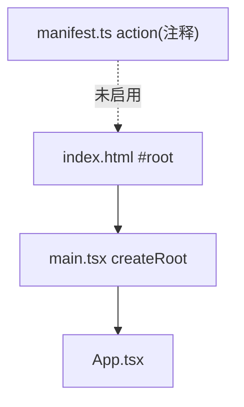

# 弹出界面架构

<cite>
**本文引用的文件**
- [src/popup/App.tsx](file://src/popup/App.tsx)
- [src/popup/main.tsx](file://src/popup/main.tsx)
- [src/manifest.ts](file://src/manifest.ts)
- [index.html](file://index.html)
</cite>

## 目录

1. [简介](#简介)
2. [现状](#现状)
3. [结构](#结构)
4. [启用与扩展](#启用与扩展)

## 简介

弹出界面（popup）是扩展工具栏图标点击后展示的 React 界面。 **当前它是占位实现，且未在清单中启用**。本节如实描述其结构与启用方式。

## 现状

- `App.tsx` 仅渲染 `<h1>Hello Extension</h1>`，无状态、无通信。
- `main.tsx` 用 React 19 `createRoot` 将 `App` 挂载到 `#root`，包裹 `StrictMode`。
- `src/manifest.ts` 的 `action.default_popup` 被注释，故 popup 不会加载。

章节来源

- [src/popup/App.tsx](file://src/popup/App.tsx)
- [src/popup/main.tsx](file://src/popup/main.tsx)
- [src/manifest.ts](file://src/manifest.ts)

## 结构

图表来源

- [index.html](file://index.html)
- [src/popup/main.tsx](file://src/popup/main.tsx)

## 启用与扩展

取消 `manifest.ts` 中 `action` 注释并指向 popup HTML 后重新构建即可启用。后续可让 popup 通过新增消息接口读取
`engine.getLastResult()` 展示脑休息指数 BRI 与分级，或提供 Option 配置界面。详见[用户界面](../../用户界面.md)。

章节来源

- [src/manifest.ts](file://src/manifest.ts)
