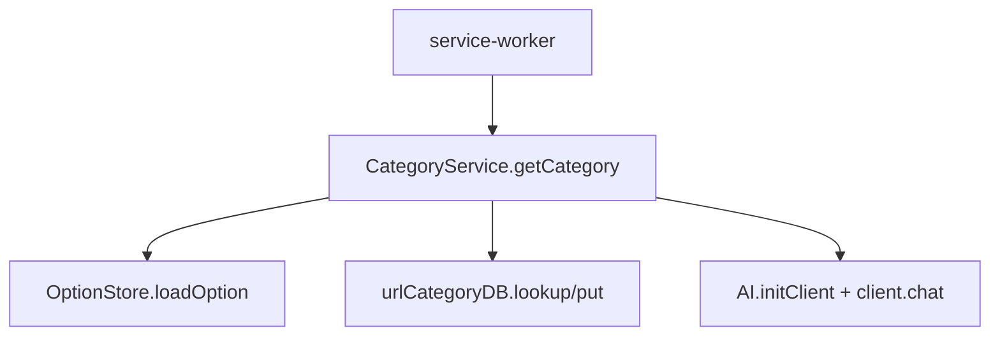

# 服务层架构

<cite>
**本文引用的文件**
- [src/services/AI.ts](file://src/services/AI.ts)
- [src/services/CategoryService.ts](file://src/services/CategoryService.ts)
- [src/services/OptionStore.ts](file://src/services/OptionStore.ts)
- [src/services/UrlCategoryDataBaseManager.ts](file://src/services/UrlCategoryDataBaseManager.ts)
- [src/services/EventDataBaseManager.ts](file://src/services/EventDataBaseManager.ts)
</cite>

## 目录
1. [简介](#简介)
2. [服务清单](#服务清单)
3. [协作关系](#协作关系)
4. [子章节](#子章节)

## 简介
服务层封装可被后台调用的能力：AI 客户端、URL 分类、配置存取与本地数据库。它们大多以模块函数或单例形式提供，无框架化的依赖注入。

## 服务清单
- **AI**：导出可变 `client` 与 `initClient(provider, apiKey)`，基于 `openai` SDK，`baseUrls` 内置 openai/deepseek，其他 provider 直接当作 baseURL。
- **CategoryService**：`getCategory`（缓存优先 + AI 兜底 + 落库）、`categorifyModel`（调用模型）、`setCategory`。
- **OptionStore**：`loadOption`/`saveOption`/`clearOption`，读取时校验回退默认。
- **UrlCategoryDataBaseManager**：单例 `urlCategoryDB`，IndexedDB 分类库（层级 lookup）。
- **EventDataBaseManager**：单例 `eventDB`，事件持久化库（**未接入**）。

## 协作关系

图表来源
- [src/services/CategoryService.ts](file://src/services/CategoryService.ts)
- [src/services/AI.ts](file://src/services/AI.ts)

章节来源
- [src/services/CategoryService.ts](file://src/services/CategoryService.ts)

## 子章节
- [选项存储管理](选项存储管理.md)
- 分类与 AI 详见[服务层模块](../../../核心模块/服务层模块.md)与[服务 API](../../../API 参考/服务 API/服务 API.md)。
