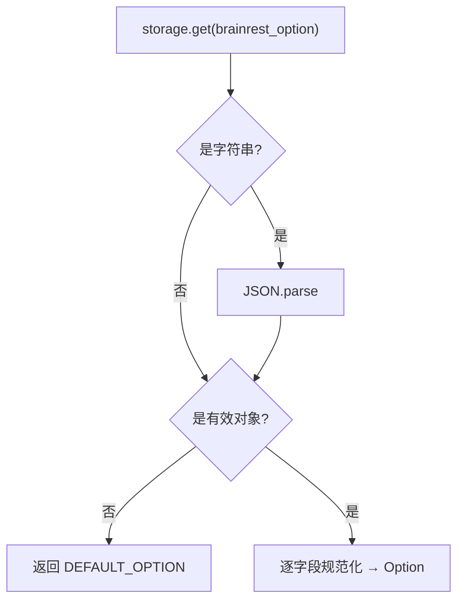

# 选项存储管理

<cite>
**本文引用的文件**
- [src/services/OptionStore.ts](file://src/services/OptionStore.ts)
- [src/models/Option.ts](file://src/models/Option.ts)
- [src/models/types.ts](file://src/models/types.ts)
</cite>

## 目录

1. [简介](#简介)
2. [Option 模型](#option-模型)
3. [存储键与默认值](#存储键与默认值)
4. [读取与校验](#读取与校验)
5. [写入与清除](#写入与清除)

## 简介

`OptionStore` 管理扩展配置（AI Provider、模型、API Key），统一基于 `chrome.storage.local`。MV3 后台没有 `localStorage`，popup 与
service worker 都通过此模块存取。

## Option 模型

```ts
export interface Option {
  aiProvider: 'openai' | 'deepseek' | AbsoluteUrl;
  categorifyModel: string;
  apiKey: string;
}
```

`AbsoluteUrl` 为模板字面量类型 `http://${string}` | `https://${string}`。

章节来源

- [src/models/Option.ts](file://src/models/Option.ts)
- [src/models/types.ts](file://src/models/types.ts)

## 存储键与默认值

- 存储键：`STORAGE_KEY = "brainrest_option"`。
- 默认值：`{ aiProvider: "openai", categorifyModel: "gpt-4o-mini", apiKey: "" }`。
- 合法内置 provider：`openai`、`deepseek`。

章节来源

- [src/services/OptionStore.ts](file://src/services/OptionStore.ts)

## 读取与校验

`loadOption()` 是防御式读取：

- 读取失败 / 空 / 非对象 → 返回默认值副本。
- 字符串值先尝试 `JSON.parse`。
- 逐字段校验：`aiProvider` 经 `normalizeProvider`（仅接受 openai/deepseek 或以 http (s):// 开头的绝对 URL，否则回退默认）；
  `categorifyModel`/`apiKey` 非字符串则回退默认。



图表来源

- [src/services/OptionStore.ts](file://src/services/OptionStore.ts)

章节来源

- [src/services/OptionStore.ts](file://src/services/OptionStore.ts)

## 写入与清除

- `saveOption(option)`：`storage.set`，失败被吞（忽略配额/不可用）。
- `clearOption()`：`storage.remove`，失败被吞。 两者均为“尽力而为”，不向调用方抛错。

章节来源

- [src/services/OptionStore.ts](file://src/services/OptionStore.ts)
