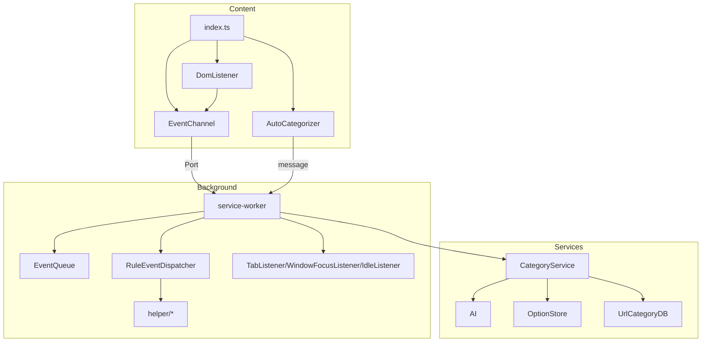

# 组件架构

<cite>
**本文引用的文件**
- [src/content/index.ts](file://src/content/index.ts)
- [src/background/service-worker.ts](file://src/background/service-worker.ts)
- [src/services/CategoryService.ts](file://src/services/CategoryService.ts)
- [src/popup/App.tsx](file://src/popup/App.tsx)
</cite>

## 目录
1. [简介](#简介)
2. [组件划分](#组件划分)
3. [依赖关系](#依赖关系)
4. [子章节](#子章节)

## 简介
BrainRest 遵循 Chrome MV3 的三上下文结构，代码组织为四大组件族：内容脚本、后台服务、服务层与弹出界面。本节给出组件全景，细节见各子章节。

## 组件划分
- **内容脚本组件**（页面上下文）：`EventChannel`、`DomListener`、`AutoCategorizer`，由 `content/index.ts` 汇总导入。
- **后台服务组件**（service worker 上下文）：`service-worker` 入口、`EventQueue`、`RuleEventDispatcher`、`TabListener`/`WindowFocusListener`/`IdleListener`、`helper/*`。
- **服务层组件**（可被后台调用）：`AI`、`CategoryService`、`OptionStore`、`UrlCategoryDataBaseManager`、`EventDataBaseManager`。
- **弹出界面组件**（popup 上下文）：`App`、`main`（占位，未启用）。

## 依赖关系

图表来源
- [src/content/index.ts](file://src/content/index.ts)
- [src/background/service-worker.ts](file://src/background/service-worker.ts)
- [src/services/CategoryService.ts](file://src/services/CategoryService.ts)

章节来源
- [src/content/index.ts](file://src/content/index.ts)
- [src/background/service-worker.ts](file://src/background/service-worker.ts)

## 子章节
- [内容脚本架构](内容脚本架构/内容脚本架构.md)
- [后台服务架构](后台服务架构/后台服务架构.md)
- [服务层架构](服务层架构/服务层架构.md)
- [弹出界面架构](弹出界面架构.md)
