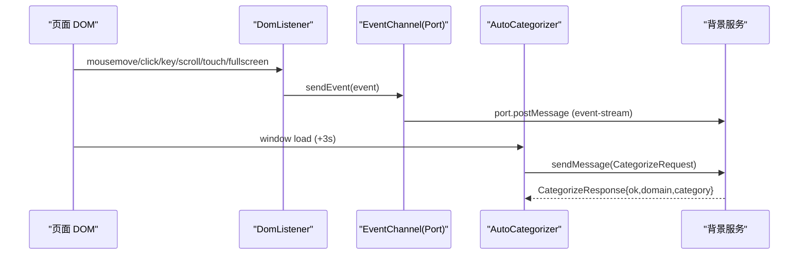

# 内容脚本模块

<cite>
**本文引用的文件**
- [src/content/index.ts](file://src/content/index.ts)
- [src/content/EventChannel.ts](file://src/content/EventChannel.ts)
- [src/content/DomListener.ts](file://src/content/DomListener.ts)
- [src/content/AutoCategorizer.ts](file://src/content/AutoCategorizer.ts)
- [src/messages.ts](file://src/messages.ts)
- [src/models/events/Event.ts](file://src/models/events/Event.ts)
</cite>

## 目录
1. [简介](#简介)
2. [模块组成](#模块组成)
3. [事件通道 EventChannel](#事件通道-eventchannel)
4. [DOM 监听器 DomListener](#dom-监听器-domlistener)
5. [自动分类器 AutoCategorizer](#自动分类器-autocategorizer)
6. [数据流](#数据流)

## 简介
内容脚本模块被注入到 `<all_urls>` 匹配的每一个页面（见 `src/manifest.ts` 的 `content_scripts`）。它承担两项职责：把用户在页面上的交互事件采集出来、通过长连接 `Port` 送往背景服务；以及在页面加载后抓取 HTML 请求背景服务做 URL 分类。

入口文件 [src/content/index.ts](file://src/content/index.ts) 仅做三行副作用导入，按顺序装配三个子模块：

```ts
import "./EventChannel";
import "./DomListener";
import "./AutoCategorizer";
```

**章节来源**
- [src/content/index.ts](file://src/content/index.ts#L1-L3)

## 模块组成
| 子模块 | 文件 | 职责 |
|--------|------|------|
| 事件通道 | `EventChannel.ts` | 建立到背景的长连接 Port，导出 `sendEvent` |
| DOM 监听器 | `DomListener.ts` | 监听鼠标/键盘/滚动/触摸/全屏，构造事件并发送 |
| 自动分类器 | `AutoCategorizer.ts` | 页面加载后抓取 HTML，发起分类请求 |

## 事件通道 EventChannel
[src/content/EventChannel.ts](file://src/content/EventChannel.ts) 在模块加载时通过 `chrome.runtime.connect` 建立一条名为 `"event-stream"` 的长连接，并导出 `sendEvent` 供其他子模块调用：

```ts
const port = chrome.runtime.connect({ name: "event-stream" });

export function sendEvent(event: Event): void {
  port.postMessage(event);
}
```

背景服务在 `chrome.runtime.onConnect` 中按名称 `"event-stream"` 过滤该连接（见 [service-worker.ts](file://src/background/service-worker.ts)），把收到的事件压入滑动窗口队列。

**章节来源**
- [src/content/EventChannel.ts](file://src/content/EventChannel.ts#L1-L10)

## DOM 监听器 DomListener
[src/content/DomListener.ts](file://src/content/DomListener.ts) 在 `document`/`window` 上注册一组监听器，把原生 DOM 事件转换为项目内的事件模型（通过 `createEvent<T>` 填充 `timestamp`、`processed`、`url` 等公共字段），再调用 `sendEvent` 发送。

采集内容：

| 原生事件 | 生成事件类型 | 说明 |
|----------|--------------|------|
| `mousemove` | `UiMouseMoveEvent` | 以 `MOUSE_MOVE_SAMPLE_MS = 200` 采样，避免高频泛滥 |
| `click` | `UiClickEvent` | 记录 `button`、`clientX/clientY` |
| `keydown` / `keyup` | `UiKeyEvent` | 记录 `key`、`code` 及修饰键状态 |
| `scroll` | `UiScrollEvent` | 记录 `scrollX/scrollY` |
| `touchstart` / `touchend` / `touchmove` | `UiTouchEvent` | 遍历 `changedTouches` 为每个触点发送一条 |
| `fullscreenchange` | `FullscreenChange` | 记录 `active` 是否进入全屏 |

每条事件的 `url` 取自 `window.location.href`；UI 事件还会附带目标元素的标签、id、class（若存在）。

**章节来源**
- [src/content/DomListener.ts](file://src/content/DomListener.ts#L1-L129)

## 自动分类器 AutoCategorizer
[src/content/AutoCategorizer.ts](file://src/content/AutoCategorizer.ts) 监听 `window` 的 `load` 事件，随后 `setTimeout` 延迟 3000ms（给 SPA 渲染留出时间）再执行 `autoCategorize()`：构造一条 `CategorizeRequest` 并通过 `chrome.runtime.sendMessage` 发送，请求体包含当前 `url` 与整页 HTML（`document.documentElement.outerHTML`）。

```ts
const request: CategorizeRequest = {
  type: "categorize",
  url: window.location.href,
  html: document.documentElement.outerHTML,
};
await chrome.runtime.sendMessage(request);
```

整个过程包裹在 `try/catch` 中，失败时静默返回，不影响页面。请求/响应的类型定义见 [src/messages.ts](file://src/messages.ts)。

**章节来源**
- [src/content/AutoCategorizer.ts](file://src/content/AutoCategorizer.ts#L1-L27)
- [src/messages.ts](file://src/messages.ts#L1-L23)

## 数据流



图表来源
- [src/content/DomListener.ts](file://src/content/DomListener.ts)
- [src/content/EventChannel.ts](file://src/content/EventChannel.ts)
- [src/content/AutoCategorizer.ts](file://src/content/AutoCategorizer.ts)

**章节来源**
- [src/content/index.ts](file://src/content/index.ts#L1-L3)
