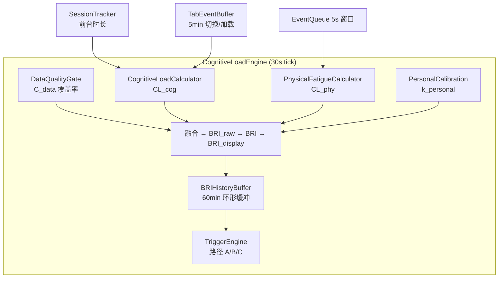

# 数据分析引擎

<cite>
**本文引用的文件**
- [src/background/engine/CognitiveLoadEngine.ts](file://src/background/engine/CognitiveLoadEngine.ts)
- [src/background/engine/CognitiveLoadCalculator.ts](file://src/background/engine/CognitiveLoadCalculator.ts)
- [src/background/engine/PhysicalFatigueCalculator.ts](file://src/background/engine/PhysicalFatigueCalculator.ts)
- [src/background/engine/TriggerEngine.ts](file://src/background/engine/TriggerEngine.ts)
- [src/background/engine/SessionTracker.ts](file://src/background/engine/SessionTracker.ts)
- [src/background/engine/DataQualityGate.ts](file://src/background/engine/DataQualityGate.ts)
- [src/background/engine/BRIHistoryBuffer.ts](file://src/background/engine/BRIHistoryBuffer.ts)
- [src/background/engine/TabEventBuffer.ts](file://src/background/engine/TabEventBuffer.ts)
- [src/background/engine/PersonalCalibration.ts](file://src/background/engine/PersonalCalibration.ts)
- [src/background/engine/types.ts](file://src/background/engine/types.ts)
- [src/background/EventQueue.ts](file://src/background/EventQueue.ts)
- [src/background/helper/MouseTrackAnalyzer.ts](file://src/background/helper/MouseTrackAnalyzer.ts)
- [src/background/helper/EventFrequencyAnalyzer.ts](file://src/background/helper/EventFrequencyAnalyzer.ts)
- [src/background/helper/KeyboardAnalyzer.ts](file://src/background/helper/KeyboardAnalyzer.ts)
- [src/background/helper/TabSwitchAnalyzer.ts](file://src/background/helper/TabSwitchAnalyzer.ts)
</cite>

## 目录

1. [简介](#简介)
2. [引擎架构](#引擎架构)
3. [认知负荷 CL_cog](#认知负荷-cl_cog)
4. [身体疲劳 CL_phy](#身体疲劳-cl_phy)
5. [BRI 融合与平滑](#bri-融合与平滑)
6. [触发路径评估](#触发路径评估)
7. [个人校准 k_personal](#个人校准-k_personal)
8. [辅助组件](#辅助组件)
9. [helper 分析器清单](#helper-分析器清单)

## 简介

数据分析引擎位于 `src/background/engine/` 目录，以 [CognitiveLoadEngine.ts](file://src/background/engine/CognitiveLoadEngine.ts) 的单例 `engine`
为核心。它每 30 秒从各信号源计算一个 0–100 的 **脑休息指数 BRI**（Brain Rest Index），并通过 TriggerEngine 评估是否命中触发路径。
引擎是**纯计算**组件——输出 `BRIResult`（含 `triggerPath`），如何利用（弹窗、通知等）由前端决定。

## 引擎架构



`engine` 通过 `getInstance()` 获取单例。`start()` 以 `TICK_MS = 30000` 注册 `setInterval` 周期调用 `tick()`；`stop()`
清除定时器。外部状态由以下方法注入：

- `receiveEvent(event)`：更新活跃度、焦点、全屏状态，记录有效采样。
- `receivePageComplexity(snapshot)`：接收页面复杂度快照。
- `setVideoFullscreen(active)`：视频全屏态。
- `setDeviceLocked(locked)`：设备锁屏态（由 `IdleListener` 驱动）。
- `setWindowFocused(focused)`：窗口焦点态（由 `WindowFocusListener` 驱动）。

`getLastResult()` 暴露最近一次 `BRIResult`。

**章节来源**

- [src/background/engine/CognitiveLoadEngine.ts](file://src/background/engine/CognitiveLoadEngine.ts#L1-L309)

## 认知负荷 CL_cog

[CognitiveLoadCalculator.ts](file://src/background/engine/CognitiveLoadCalculator.ts) 计算认知负荷子指数（0-100）：

```
CL_cog = 0.35·D + 0.15·B + 0.30·P + 0.20·T
```

| 信号 | 含义 | 计算方式 |
|------|------|----------|
| D | 时长得分 | `min(t_front / 60min × 100, 100)` |
| B | 页面类型基线 | 查 `TYPE_BASELINE` 表（11 类，35-90 分） |
| ρ | 文字密度得分 | `min(ρ_raw / 50×10⁻⁴ × 100, 100)` |
| S | 结构复杂度得分 | `(table×3 + code×2 + list×1.5 + heading×1) / 10`，clamp [0,1] × 100 |
| P | 页面综合复杂度 | `0.70·ρ + 0.30·S` |
| T | 切换负荷 | `min(N_switch × 12.5 + N_load × 7.5, 100)` |

数据来源：`SessionTracker`（前台时长）、`UrlCategoryDataBaseManager`（页面类型）、`PageComplexityAnalyzer`（复杂度快照）、`TabEventBuffer`（切换/加载计数）。

**章节来源**

- [src/background/engine/CognitiveLoadCalculator.ts](file://src/background/engine/CognitiveLoadCalculator.ts#L1-L80)
- [src/background/engine/types.ts](file://src/background/engine/types.ts#L114-L127)

## 身体疲劳 CL_phy

[PhysicalFatigueCalculator.ts](file://src/background/engine/PhysicalFatigueCalculator.ts) 计算身体疲劳子指数（0-100）：

```
CL_phy = [(0.30·E + 0.20·L + 0.25·I + 0.25·R) / 100] × (1 - R_rest/100) × 100
```

| 信号 | 含义 | 计算方式 | 来源 |
|------|------|----------|------|
| E | 轨迹熵得分 | 8 方向香农熵 / 3bit × 100 | `MouseTrackAnalyzer.calcuateMouseAnthropy()` |
| L | 眼-手延迟得分 | `min(τ / 500ms × 100, 100)` | `MouseTrackAnalyzer.calculateEyeHandDelay()` |
| I | 交互强度得分 | `min(freq / 10s⁻¹ × 100, 100)` | `EventFrequencyAnalyzer.calculateEventFrequency()` |
| R | 修正负荷得分 | `deleteKeyRatio × 100` | `KeyboardAnalyzer.calculateDeleteKeyRatio()` |
| R_rest | 休息衰减因子 | 查表取最大值 | 见下表 |

休息衰减因子 R_rest：

| 场景 | 权重 |
|------|------|
| 设备锁屏 | 80 |
| 窗口失焦 > 30s | 50 |
| 鼠标静止 > 20s | 40 |
| 视频全屏 | 30 |
| 普通 | 0 |

**章节来源**

- [src/background/engine/PhysicalFatigueCalculator.ts](file://src/background/engine/PhysicalFatigueCalculator.ts#L1-L136)

## BRI 融合与平滑

`CognitiveLoadEngine.tick()` 执行完整计算链：

1. **数据质量门控**：`C_data < 0.70` → 输出 `insufficient_data`，不更新 BRI_display。
2. **融合**：`BRI_raw = min(max(CL_cog, CL_phy) + 0.30 × min(CL_cog, CL_phy), 100)`
3. **校准**：`BRI = BRI_raw × k_personal`
4. **平滑**（一阶低通滤波）：`BRI_display(t) = 0.25 × min(BRI(t), 100) + 0.75 × BRI_display(t-1)`
5. **存入历史**：`BRIHistoryBuffer.push(briDisplay)`（60min 环形缓冲）
6. **分级**：`briDisplay ≥ 70 → high`、`≥ 40 → moderate`、否则 `low`

**章节来源**

- [src/background/engine/CognitiveLoadEngine.ts](file://src/background/engine/CognitiveLoadEngine.ts#L194-L286)

## 触发路径评估

[TriggerEngine.ts](file://src/background/engine/TriggerEngine.ts) 在每次 tick 末尾评估，仅做数值判定，命中结果附在 `BRIResult.triggerPath` 中输出。

**硬门槛**（必须同时满足）：

| 条件 | 阈值 |
|------|------|
| 有效前台时长 | ≥ 30 min |
| 数据新鲜度 | 最新样本距现在 < 120s |
| 数据覆盖率 | ≥ 0.70 |
| 冷却期 | 距上次命中 ≥ 30 min |

**三条触发路径**（满足任一即命中）：

| 路径 | 条件 |
|------|------|
| A 持续高负荷 | 最近 30min 内 BRI_display ≥ 70 累计 ≥ 20min |
| B 累积等效负荷 | 最近 60min AUC 积分 ≥ 4000 score·min |
| C 神经肌肉疲劳 | CL_phy ≥ 70 且 E ≥ 60 且 眼手延迟 ≥ 300ms 且 前台 ≥ 15min |

**章节来源**

- [src/background/engine/TriggerEngine.ts](file://src/background/engine/TriggerEngine.ts#L1-L171)

## 个人校准 k_personal

[PersonalCalibration.ts](file://src/background/engine/PersonalCalibration.ts) 管理校准系数 k_personal（范围 0.5–1.5，初始 1.0）：

- 连续 3 次在 BRI_display < 60 时用户主动休息 → k -= 0.05（敏感型）
- 连续 3 次在 BRI_display ≥ 75 时用户忽略提示 → k += 0.05（耐受型）
- 每 7 天自动校准（以 BRI 分布 P80 反推）

持久化到 `chrome.storage.local`（键 `brainrest_k_personal`）。

**章节来源**

- [src/background/engine/PersonalCalibration.ts](file://src/background/engine/PersonalCalibration.ts#L1-L179)

## 辅助组件

| 组件 | 文件 | 职责 |
|------|------|------|
| SessionTracker | `engine/SessionTracker.ts` | 追踪连续前台时长 t_front（分钟），窗口失焦/锁屏时暂停 |
| DataQualityGate | `engine/DataQualityGate.ts` | 120s 评估窗口内有效采样覆盖率 C_data |
| BRIHistoryBuffer | `engine/BRIHistoryBuffer.ts` | 60min 环形缓冲，支持路径 A（高负荷时长）和路径 B（AUC 梯形积分） |
| TabEventBuffer | `engine/TabEventBuffer.ts` | 5min 环形缓冲，记录 N_switch 和 N_load |

**章节来源**

- [src/background/engine/SessionTracker.ts](file://src/background/engine/SessionTracker.ts#L1-L81)
- [src/background/engine/DataQualityGate.ts](file://src/background/engine/DataQualityGate.ts#L1-L113)
- [src/background/engine/BRIHistoryBuffer.ts](file://src/background/engine/BRIHistoryBuffer.ts#L1-L99)
- [src/background/engine/TabEventBuffer.ts](file://src/background/engine/TabEventBuffer.ts#L1-L56)

## helper 分析器清单

`helper/` 目录下的分析器均已被引擎接入：

| 分析器 | 接入位置 | 提供信号 |
|--------|----------|----------|
| `MouseTrackAnalyzer` | PhysicalFatigueCalculator + TriggerEngine | E（轨迹熵）、L（眼手延迟） |
| `EventFrequencyAnalyzer` | PhysicalFatigueCalculator | I（交互频率） |
| `KeyboardAnalyzer` | PhysicalFatigueCalculator | R（删除键占比） |
| `TabSwitchAnalyzer` | 封装 TabEventBuffer 查询 | N_switch / N_load |

**章节来源**

- [src/background/helper/MouseTrackAnalyzer.ts](file://src/background/helper/MouseTrackAnalyzer.ts#L1-L147)
- [src/background/helper/EventFrequencyAnalyzer.ts](file://src/background/helper/EventFrequencyAnalyzer.ts#L1-L23)
- [src/background/helper/KeyboardAnalyzer.ts](file://src/background/helper/KeyboardAnalyzer.ts#L1-L33)
- [src/background/helper/TabSwitchAnalyzer.ts](file://src/background/helper/TabSwitchAnalyzer.ts#L1-L18)
