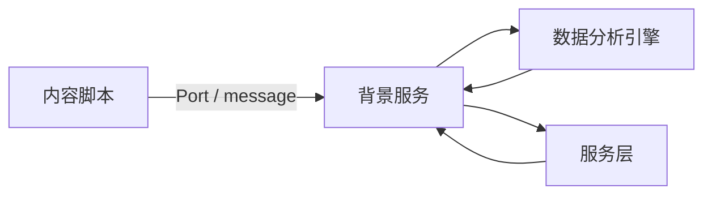

# 核心模块

<cite>
**本文引用的文件**
- [src/content/index.ts](file://src/content/index.ts)
- [src/background/service-worker.ts](file://src/background/service-worker.ts)
- [src/background/RuleEventDispatcher.ts](file://src/background/RuleEventDispatcher.ts)
- [src/services/CategoryService.ts](file://src/services/CategoryService.ts)
</cite>

## 目录
1. [简介](#简介)
2. [模块总览](#模块总览)
3. [协作方式](#协作方式)
4. [子章节](#子章节)

## 简介
本章按运行时职责介绍 BrainRest 的四个核心模块：内容脚本、背景服务、服务层与数据分析引擎。它们共同完成“采集 → 计算疲劳 → 分类”的主流程。

## 模块总览
| 模块 | 位置 | 职责 |
|------|------|------|
| 内容脚本模块 | `src/content` | 采集页面事件、发起分类 |
| 背景服务模块 | `src/background` | 事件队列、监听器、调度 |
| 服务层模块 | `src/services` | AI、分类、配置、数据库 |
| 数据分析引擎 | `src/background/RuleEventDispatcher.ts` + `helper/*` | 计算疲劳指数 |

## 协作方式

图表来源
- [src/content/index.ts](file://src/content/index.ts)
- [src/background/service-worker.ts](file://src/background/service-worker.ts)

章节来源
- [src/background/service-worker.ts](file://src/background/service-worker.ts)

## 子章节
- [内容脚本模块](内容脚本模块.md)
- [背景服务模块](背景服务模块.md)
- [服务层模块](服务层模块.md)
- [数据分析引擎](数据分析引擎.md)
