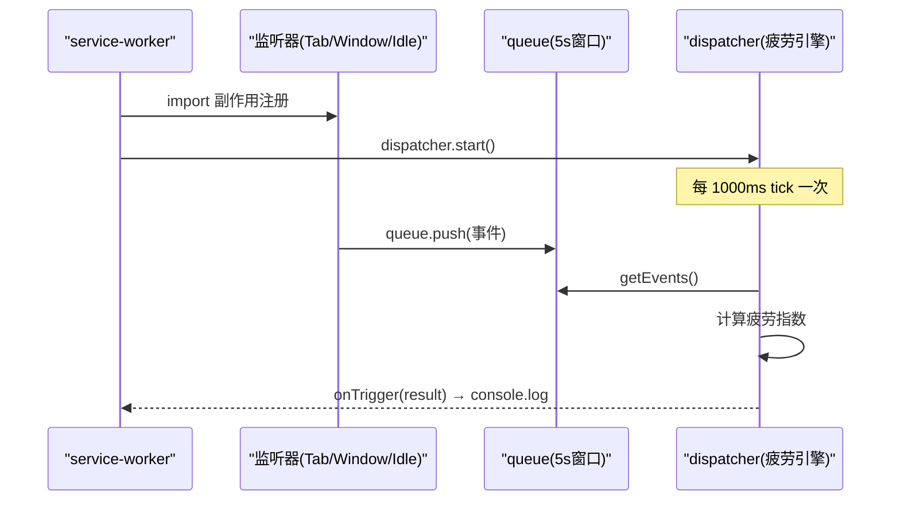

# 背景服务模块

<cite>
**本文引用的文件**
- [src/background/service-worker.ts](file://src/background/service-worker.ts)
- [src/background/EventQueue.ts](file://src/background/EventQueue.ts)
- [src/background/TabListener.ts](file://src/background/TabListener.ts)
- [src/background/WindowFocusListener.ts](file://src/background/WindowFocusListener.ts)
- [src/background/IdleListener.ts](file://src/background/IdleListener.ts)
- [src/background/RuleEventDispatcher.ts](file://src/background/RuleEventDispatcher.ts)
- [src/messages.ts](file://src/messages.ts)
</cite>

## 目录
1. [简介](#简介)
2. [service worker 入口](#service-worker-入口)
3. [事件队列 EventQueue](#事件队列-eventqueue)
4. [浏览器监听器](#浏览器监听器)
5. [消息处理：分类请求](#消息处理分类请求)
6. [启动与运行时序](#启动与运行时序)

## 简介
背景服务模块运行在 Manifest V3 的 service worker 中（`src/manifest.ts` 指定 `background.service_worker = "src/background/service-worker.ts"`，`type: module`）。它是整个扩展的中枢：接收内容脚本发来的事件、监听浏览器级事件（标签页、窗口焦点、空闲状态）、维护 5 秒滑动窗口队列，并驱动疲劳分析引擎周期性计算。

## service worker 入口
[src/background/service-worker.ts](file://src/background/service-worker.ts) 在加载时先以副作用方式导入三个浏览器监听器模块，再启动调度器并注册两类运行时监听：

```ts
import "./TabListener";
import "./WindowFocusListener";
import "./IdleListener";

dispatcher.start();

dispatcher.onTrigger((result) => {
  console.log(`[BrainRest] fatigue=${...} level=${...} R=${...}`);
});
```

- `chrome.runtime.onConnect`：只处理名为 `"event-stream"` 的连接，将其 `onMessage` 收到的事件 `queue.push` 入队。
- `chrome.runtime.onMessage`：用 `isCategorizeRequest` 守卫识别分类请求，调用 `getCategory` 后回传响应；返回 `true` 以保持异步通道打开。

**章节来源**
- [src/background/service-worker.ts](file://src/background/service-worker.ts#L1-L53)

## 事件队列 EventQueue
[src/background/EventQueue.ts](file://src/background/EventQueue.ts) 实现一个极简的定长时间窗口队列 `SlidingWindowQueue`，窗口为 `SLIDE_WINDOW_MS = 5000`（5 秒），并导出单例 `queue`。

```ts
export const SLIDE_WINDOW_MS = 5000;

class SlidingWindowQueue {
  push(...items: Event[]): number { /* trim 后返回长度 */ }
  getEvents(): Event[] { /* trim 后返回副本 */ }
  private trim(): void { /* 弹出 timestamp < now - 5000 的事件 */ }
}

export const queue = new SlidingWindowQueue();
```

队列只保留最近 5 秒的事件，`push` 与 `getEvents` 都会先 `trim` 过期项。它是内容脚本事件、标签页事件、窗口焦点事件的统一汇聚点，也是疲劳引擎每秒计算的输入。

**章节来源**
- [src/background/EventQueue.ts](file://src/background/EventQueue.ts#L1-L29)

## 浏览器监听器
三个监听器均以模块级 `chrome.*.addListener` 的形式注册（不是类），在被 `service-worker.ts` 导入时即生效。

| 监听器 | 监听的 API | 行为 |
|--------|-----------|------|
| `TabListener` | `chrome.tabs.on{Created,Removed,Updated,Activated}` | 维护 `tabUrls` 映射，生成 `tab_created` / `tab_closed` / `tab_changed` / `tab_activated` 事件并 `queue.push` |
| `WindowFocusListener` | `chrome.windows.onFocusChanged` | 窗口 ID 为 `WINDOW_ID_NONE` 时产生 `blur`，否则 `focus`，入队（`url: ""`） |
| `IdleListener` | `chrome.idle`（`setDetectionInterval(60)`） | 状态变化时调用 `dispatcher.setDeviceLocked(state === "locked")`，**不入队**，直接向引擎注入锁屏状态 |

`TabListener` 中 `onUpdated` 仅在 `changeInfo.url` 存在时才生成 `tab_changed`（附带 `old_url` / `new_url`）；`onActivated` 记录 `windowId`。`IdleListener` 启动时还会 `queryState` 做一次初始对齐。

**章节来源**
- [src/background/TabListener.ts](file://src/background/TabListener.ts#L1-L51)
- [src/background/WindowFocusListener.ts](file://src/background/WindowFocusListener.ts#L1-L12)
- [src/background/IdleListener.ts](file://src/background/IdleListener.ts#L1-L19)

## 消息处理：分类请求
内容脚本的 `AutoCategorizer` 通过 `chrome.runtime.sendMessage` 发送 `CategorizeRequest`。`service-worker.ts` 在 `onMessage` 中：

1. 用 `isCategorizeRequest(message)` 守卫过滤；
2. 调用 `getCategory(url, html)` 完成分类（缓存优先，未命中则走 AI）；
3. 成功回传 `{ ok: true, domain, category }`，异常回传 `{ ok: false, error }`；
4. `return true` 保持异步响应通道。

类型定义见 [src/messages.ts](file://src/messages.ts)。

**章节来源**
- [src/background/service-worker.ts](file://src/background/service-worker.ts#L1-L53)
- [src/messages.ts](file://src/messages.ts#L1-L23)

## 启动与运行时序



图表来源
- [src/background/service-worker.ts](file://src/background/service-worker.ts)
- [src/background/RuleEventDispatcher.ts](file://src/background/RuleEventDispatcher.ts)

**章节来源**
- [src/background/service-worker.ts](file://src/background/service-worker.ts#L1-L53)
- [src/background/RuleEventDispatcher.ts](file://src/background/RuleEventDispatcher.ts#L1-L474)
