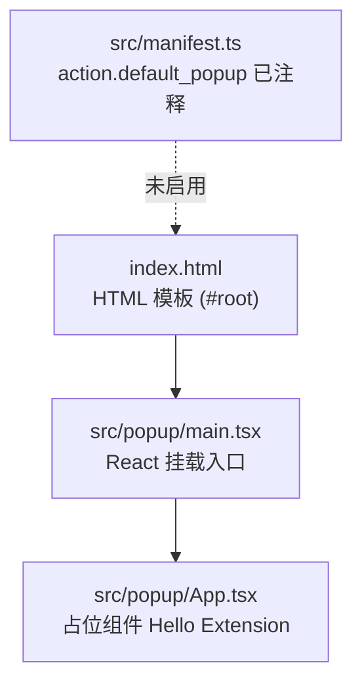
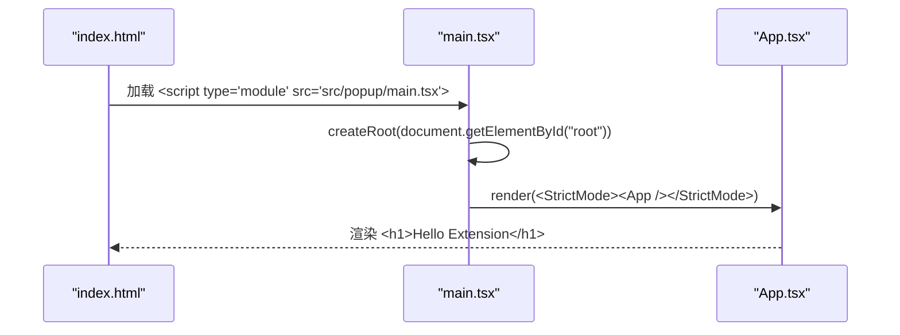

# 用户界面

<cite>
**本文引用的文件**
- [src/popup/App.tsx](file://src/popup/App.tsx)
- [src/popup/main.tsx](file://src/popup/main.tsx)
- [index.html](file://index.html)
- [src/manifest.ts](file://src/manifest.ts)
- [vite.config.ts](file://vite.config.ts)
</cite>

## 目录

1. [简介](#简介)
2. [当前实现状态](#当前实现状态)
3. [项目结构](#项目结构)
4. [启动链路](#启动链路)
5. [源码说明](#源码说明)
6. [如何启用 Popup](#如何启用-popup)
7. [后续扩展方向](#后续扩展方向)

## 简介

本章节描述 BrainRest 扩展的用户界面（popup）现状。 **需要特别说明的是：当前 UI 仅为占位实现**——`App.tsx` 只渲染一个静态标题
`Hello Extension`，并且 popup 入口在 `src/manifest.ts` 中被注释掉，因此扩展当前并不会显示任何
popup。本文如实记录这一状态，并说明启用与扩展的方式，不描述尚未实现的主题、动画、可访问性等能力。

## 当前实现状态

- ✅ 存在一个最小 React 应用（`main.tsx` + `App.tsx`），可被 Vite 构建。
- ✅ 存在 HTML 模板 `index.html`，包含 `#root` 挂载点并引入 `src/popup/main.tsx`。
- ⚠️ `App.tsx` 仅渲染 `<h1>Hello Extension</h1>`，无任何业务逻辑、状态或与后台的通信。
- ❌ `src/manifest.ts` 中的 `action.default_popup` 被注释，popup **未在扩展中启用**。
- ❌ 没有主题系统、路由、可访问性处理、动画或与 service worker 的消息交互。

## 项目结构

UI 相关文件位于 `src/popup` 目录，配合根目录的 HTML 模板与清单：

图表来源

- [index.html](file://index.html)
- [src/popup/main.tsx](file://src/popup/main.tsx)
- [src/popup/App.tsx](file://src/popup/App.tsx)
- [src/manifest.ts](file://src/manifest.ts)

章节来源

- [src/popup/App.tsx](file://src/popup/App.tsx)
- [src/popup/main.tsx](file://src/popup/main.tsx)
- [index.html](file://index.html)
- [src/manifest.ts](file://src/manifest.ts)

## 启动链路

若 popup 被启用，其加载与渲染链路如下：

图表来源

- [index.html](file://index.html)
- [src/popup/main.tsx](file://src/popup/main.tsx)
- [src/popup/App.tsx](file://src/popup/App.tsx)

## 源码说明

### main.tsx

使用 React 19 的 `createRoot` 将 `App` 挂载到 `#root`，包裹在 `StrictMode` 中。这是标准的 React 启动样板，没有额外的全局样式、主题或错误边界注入。

章节来源

- [src/popup/main.tsx](file://src/popup/main.tsx)

### App.tsx

顶层组件，当前仅返回一个 `<h1>Hello Extension</h1>`。没有 props、状态、副作用或子组件，属于脚手架占位内容。

章节来源

- [src/popup/App.tsx](file://src/popup/App.tsx)

## 如何启用 Popup

默认情况下 popup 不会出现在扩展中。要启用它，需要在 `src/manifest.ts` 中取消对 `action` 字段的注释，使其指向 popup 的 HTML
入口（如 `index.html`），随后重新执行构建。启用后浏览器工具栏点击扩展图标即可看到上述占位页面。

章节来源

- [src/manifest.ts](file://src/manifest.ts)

## 后续扩展方向

以下能力目前 **尚未实现**，可作为后续开发方向（本文不将其描述为现有特性）：

- 展示实时脑休息指数 BRI 与分级（依赖 background 的 `engine.getLastResult()` 结果，需要新增消息接口）。
- 提供 AI Provider / API Key 等选项的配置界面（对应 `services/OptionStore.ts` 的 Option 模型）。
- 主题、可访问性与国际化支持。

章节来源

- [src/popup/App.tsx](file://src/popup/App.tsx)
- [src/manifest.ts](file://src/manifest.ts)
