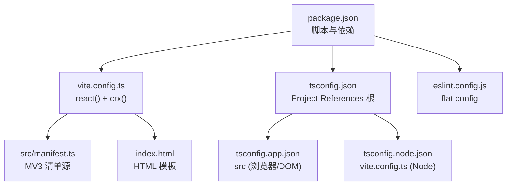
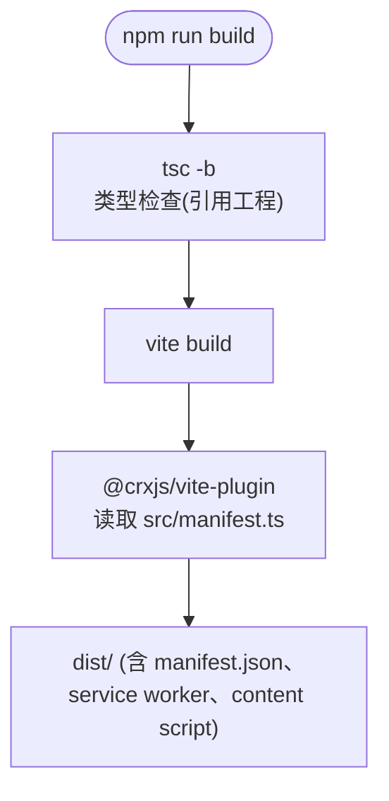

# 配置与构建

<cite>
**本文引用的文件**
- [package.json](file://package.json)
- [vite.config.ts](file://vite.config.ts)
- [tsconfig.json](file://tsconfig.json)
- [tsconfig.app.json](file://tsconfig.app.json)
- [tsconfig.node.json](file://tsconfig.node.json)
- [eslint.config.js](file://eslint.config.js)
- [index.html](file://index.html)
- [src/manifest.ts](file://src/manifest.ts)
</cite>

## 目录
1. [简介](#简介)
2. [配置文件总览](#配置文件总览)
3. [NPM 脚本](#npm-脚本)
4. [Vite 构建配置](#vite-构建配置)
5. [TypeScript 配置](#typescript-配置)
6. [ESLint 配置](#eslint-配置)
7. [扩展清单 manifest.ts](#扩展清单-manifestts)
8. [HTML 入口](#html-入口)
9. [依赖清单](#依赖清单)
10. [已知不一致点](#已知不一致点)

## 简介
BrainRest 使用 Vite 8 + `@crxjs/vite-plugin` 构建 Chrome MV3 扩展。清单以 TypeScript（`src/manifest.ts`）形式维护，由 CRXJS 插件在构建期生成 `manifest.json` 并处理 content script / service worker 的打包与 HMR。本文如实记录仓库中的真实配置，不含 `.env` 等仓库未使用的内容。

## 配置文件总览

图表来源
- [package.json](file://package.json)
- [vite.config.ts](file://vite.config.ts)
- [tsconfig.json](file://tsconfig.json)
- [tsconfig.app.json](file://tsconfig.app.json)
- [tsconfig.node.json](file://tsconfig.node.json)
- [eslint.config.js](file://eslint.config.js)
- [src/manifest.ts](file://src/manifest.ts)

## NPM 脚本
`package.json` 定义了如下脚本（`"type": "module"`，包版本 `0.0.0`）：

| 脚本 | 命令 | 说明 |
|------|------|------|
| `dev` | `vite` | 启动 Vite 开发服务器，配合 CRXJS 提供扩展 HMR |
| `build` | `tsc -b && vite build` | 先做 Project References 类型检查，再产出 `dist` |
| `debug` | `tsc -b && vite build --sourcemap` | 同 build，但强制生成 sourcemap |
| `lint` | `eslint .` | 运行 ESLint |
| `preview` | `vite preview` | 预览生产构建 |

章节来源
- [package.json](file://package.json)

## Vite 构建配置
`vite.config.ts` 的关键点：
- 插件：`react()` 与 `crx({ manifest, contentScripts: { standaloneFiles: ["src/content/index.ts"] } })`。`standaloneFiles` 让内容脚本作为独立文件打包。
- `build.sourcemap: true`、`build.minify: false`：产物保留可读性与 sourcemap，便于调试。
- `server.sourcemapIgnoreList: () => false`：开发时不忽略任何 sourcemap 条目。
- 清单由 `import manifest from "./src/manifest.ts"` 提供给 `crx` 插件。

图表来源
- [vite.config.ts](file://vite.config.ts)
- [package.json](file://package.json)
- [src/manifest.ts](file://src/manifest.ts)

章节来源
- [vite.config.ts](file://vite.config.ts)

## TypeScript 配置
采用 Project References 结构：
- `tsconfig.json`：根配置，`files: []`，引用 `tsconfig.app.json` 与 `tsconfig.node.json`，开启 `sourceMap`。
- `tsconfig.app.json`（`include: ["src"]`）：`target/lib` 为 ES2023 + DOM，`types: ["vite/client", "chrome"]`，`moduleResolution: "bundler"`，`jsx: "react-jsx"`，`noEmit: true`，并开启 `noUnusedLocals`/`noUnusedParameters`/`erasableSyntaxOnly`/`noFallthroughCasesInSwitch` 等严格检查。
- `tsconfig.node.json`（`include: ["vite.config.ts"]`）：`types: ["node"]`，`module: "nodenext"`，用于构建脚本本身的类型检查。

章节来源
- [tsconfig.json](file://tsconfig.json)
- [tsconfig.app.json](file://tsconfig.app.json)
- [tsconfig.node.json](file://tsconfig.node.json)

## ESLint 配置
`eslint.config.js` 使用 ESLint 扁平配置（flat config）：
- 全局忽略 `dist`。
- 对 `**/*.{ts,tsx}` 应用：`@eslint/js` recommended、`typescript-eslint` recommended、`eslint-plugin-react-hooks`（flat.recommended）、`eslint-plugin-react-refresh`（vite）。
- `languageOptions.globals` 为 `globals.browser`。

章节来源
- [eslint.config.js](file://eslint.config.js)

## 扩展清单 manifest.ts
`src/manifest.ts` 以 `satisfies ManifestV3Export` 导出 MV3 清单：
- `name: "BrainRest"`，`version: "1.0.0"`，`description: "Train your brain to rest better!"`，含固定 `key`。
- `permissions: ["tabs", "windows", "storage", "idle"]`。
- `host_permissions: ["https://api.openai.com/*", "https://api.deepseek.com/*"]`，用于后台调用 AI 接口；自定义 `aiProvider` 为其他绝对 URL 时需在此追加。
- `background.service_worker: "src/background/service-worker.ts"`，`type: "module"`。
- `content_scripts`：`matches: ["<all_urls>"]`，`js: ["src/content/index.ts"]`。
- `action.default_popup` **被注释掉**（指向 `src/popup/index.html`），因此 popup 当前未启用。

章节来源
- [src/manifest.ts](file://src/manifest.ts)

## HTML 入口
根目录 `index.html` 定义 `
` 与 `<script type="module" src="/src/main.tsx">`，`<title>` 为 `brainllo`。它是 React popup 的模板基础，但注意其脚本路径指向 `/src/main.tsx`（实际 React 入口位于 `src/popup/main.tsx`），且 popup 尚未在清单中启用（见[已知不一致点](#已知不一致点)）。

章节来源
- [index.html](file://index.html)
- [src/manifest.ts](file://src/manifest.ts)

## 依赖清单
运行时依赖（`dependencies`）：
- `idb ^8.0.3`：IndexedDB 封装，用于事件库与 URL 分类库。
- `openai ^6.48.0`：调用 OpenAI/DeepSeek 兼容接口做 URL 分类。
- `react ^19.2.7` / `react-dom ^19.2.7`：popup UI。
- `markitdown-html ^0.1.0`：**已声明但代码中未使用**。

主要开发依赖（`devDependencies`）：`@crxjs/vite-plugin ^2.7.1`、`@vitejs/plugin-react ^6.0.3`、`vite ^8.1.1`、`typescript ~6.0.2`、`typescript-eslint ^8.62.0`、`@types/chrome`、`@types/node` 等。

章节来源
- [package.json](file://package.json)

## 已知不一致点
以下是构建/配置层面与常规预期不符、值得后续修正之处：
- `package.json` 的包版本为 `0.0.0`，而清单版本为 `1.0.0`，两者不同步。
- `index.html` 引用 `/src/main.tsx`，但实际 React 入口是 `src/popup/main.tsx`；`<title>` 为遗留的 `brainllo`。
- 清单中 `action.default_popup` 被注释，popup 不会加载。
- `markitdown-html` 依赖未被任何源码引用。

章节来源
- [package.json](file://package.json)
- [index.html](file://index.html)
- [src/manifest.ts](file://src/manifest.ts)
