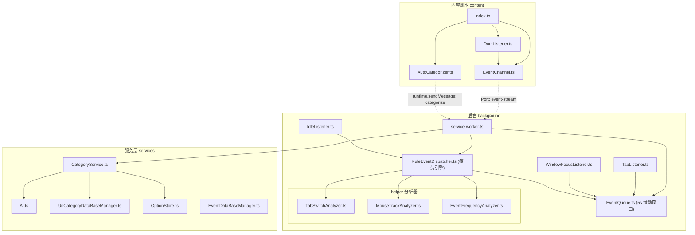
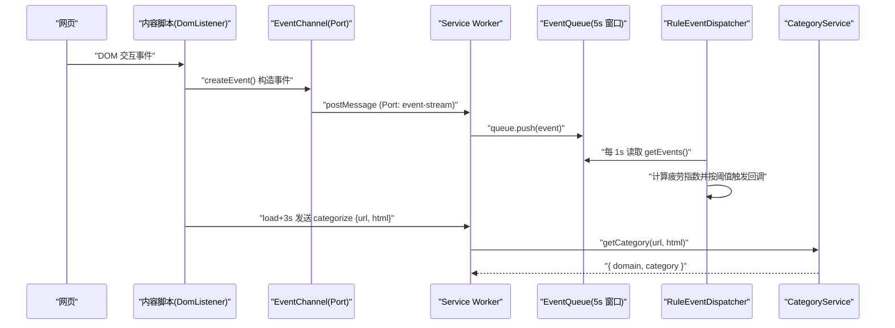

# 项目概述

<cite>
**本文引用的文件**
- [README.md](file://README.md)
- [package.json](file://package.json)
- [vite.config.ts](file://vite.config.ts)
- [manifest.ts](file://src/manifest.ts)
- [service-worker.ts](file://src/background/service-worker.ts)
- [RuleEventDispatcher.ts](file://src/background/RuleEventDispatcher.ts)
- [EventQueue.ts](file://src/background/EventQueue.ts)
- [TabListener.ts](file://src/background/TabListener.ts)
- [WindowFocusListener.ts](file://src/background/WindowFocusListener.ts)
- [IdleListener.ts](file://src/background/IdleListener.ts)
- [index.ts](file://src/content/index.ts)
- [DomListener.ts](file://src/content/DomListener.ts)
- [EventChannel.ts](file://src/content/EventChannel.ts)
- [AutoCategorizer.ts](file://src/content/AutoCategorizer.ts)
- [messages.ts](file://src/messages.ts)
- [Event.ts](file://src/models/events/Event.ts)
- [types.ts](file://src/models/types.ts)
- [Option.ts](file://src/models/Option.ts)
- [AI.ts](file://src/services/AI.ts)
- [CategoryService.ts](file://src/services/CategoryService.ts)
- [OptionStore.ts](file://src/services/OptionStore.ts)
- [UrlCategoryDataBaseManager.ts](file://src/services/UrlCategoryDataBaseManager.ts)
- [EventDataBaseManager.ts](file://src/services/EventDataBaseManager.ts)
- [App.tsx](file://src/popup/App.tsx)
- [main.tsx](file://src/popup/main.tsx)
</cite>

## 目录
1. [简介](#简介)
2. [项目结构](#项目结构)
3. [核心组件](#核心组件)
4. [端到端数据流](#端到端数据流)
5. [疲劳指数计算](#疲劳指数计算)
6. [服务层能力](#服务层能力)
7. [当前实现状态](#当前实现状态)
8. [快速开始](#快速开始)

## 简介
BrainRest 是一个 Chrome Manifest V3 浏览器扩展，定位为“训练大脑更好休息”。它在后台持续采集浏览器与页面内的用户交互事件，基于一个 **5 秒滑动窗口** 计算实时**疲劳指数**（fatigue index），并在疲劳达到阈值时触发提醒回调；同时对访问过的站点做基于 AI 的 URL 分类，为疲劳判定提供上下文。

项目遵循“内容脚本采集 → 后台处理 → 服务层能力”的职责分离：
- **内容脚本**（content）在页面中捕获 DOM 交互事件，通过长连接 Port 上报后台；并在页面加载后请求对当前站点做分类。
- **后台服务**（background）在 Service Worker 中维护滑动窗口事件队列、监听标签页/窗口/空闲状态，并运行疲劳指数计算循环。
- **服务层**（services）封装 AI 调用、URL 分类数据库、选项存储与事件数据库。
- **数据模型**（models）以 TypeScript 接口统一描述事件、配置与类型。

> 说明：弹出界面（popup）目前仅为占位页，尚未在 manifest 中启用。

**章节来源**
- [README.md](file://README.md)
- [manifest.ts](file://src/manifest.ts)
- [service-worker.ts](file://src/background/service-worker.ts)

## 项目结构


目录说明：
- `src/content`：DOM 事件采集、事件通道、自动分类触发。
- `src/background`：Service Worker 入口、滑动窗口队列、疲劳分发器、浏览器级监听器与指标分析器（helper）。
- `src/services`：AI、URL 分类库、选项存储、事件数据库。
- `src/models`：事件模型、配置与共享类型。
- `src/popup`：React 占位界面。
- `src/manifest.ts`：MV3 清单配置。

**章节来源**
- [manifest.ts](file://src/manifest.ts)
- [service-worker.ts](file://src/background/service-worker.ts)
- [index.ts](file://src/content/index.ts)

## 核心组件
- **内容脚本 content**
  - [EventChannel.ts](file://src/content/EventChannel.ts)：通过 `chrome.runtime.connect({ name: "event-stream" })` 建立长连接，`sendEvent()` 将事件 `postMessage` 给后台。
  - [DomListener.ts](file://src/content/DomListener.ts)：监听 `mousemove`（每 200ms 采样一次）、`click`、`keydown`/`keyup`、`scroll`、`touchstart`/`touchmove`/`touchend`、`fullscreenchange`，构造为事件模型后经通道上报。
  - [AutoCategorizer.ts](file://src/content/AutoCategorizer.ts)：页面 `load` 后 3 秒，发送 `categorize` 运行时消息（携带 `url` 与 `html`）给后台。

- **后台 background**
  - [service-worker.ts](file://src/background/service-worker.ts)：启动疲劳循环、订阅触发回调（当前打印到控制台）；接收 `event-stream` Port 消息入队；处理 `categorize` 消息并调用分类服务。
  - [EventQueue.ts](file://src/background/EventQueue.ts)：`SLIDE_WINDOW_MS = 5000` 的内存滑动窗口队列，仅提供 `push()` 与 `getEvents()`。
  - [RuleEventDispatcher.ts](file://src/background/RuleEventDispatcher.ts)：疲劳指数计算引擎（单例）。
  - [TabListener.ts](file://src/background/TabListener.ts) / [WindowFocusListener.ts](file://src/background/WindowFocusListener.ts) / [IdleListener.ts](file://src/background/IdleListener.ts)：分别采集标签页、窗口焦点、系统锁屏状态。

- **服务层 services**
  - [CategoryService.ts](file://src/services/CategoryService.ts)、[AI.ts](file://src/services/AI.ts)、[UrlCategoryDataBaseManager.ts](file://src/services/UrlCategoryDataBaseManager.ts)、[OptionStore.ts](file://src/services/OptionStore.ts)、[EventDataBaseManager.ts](file://src/services/EventDataBaseManager.ts)。

**章节来源**
- [EventChannel.ts](file://src/content/EventChannel.ts)
- [DomListener.ts](file://src/content/DomListener.ts)
- [AutoCategorizer.ts](file://src/content/AutoCategorizer.ts)
- [service-worker.ts](file://src/background/service-worker.ts)

## 端到端数据流


事件流当前只驻留在内存的 5 秒滑动窗口中；标签页/窗口监听器也直接向该队列 `push`。分类结果写入 IndexedDB（`UrlCategoryDataBaseManager`），供切换熵等下游分析反查。

**章节来源**
- [DomListener.ts](file://src/content/DomListener.ts)
- [EventChannel.ts](file://src/content/EventChannel.ts)
- [service-worker.ts](file://src/background/service-worker.ts)
- [EventQueue.ts](file://src/background/EventQueue.ts)
- [RuleEventDispatcher.ts](file://src/background/RuleEventDispatcher.ts)

## 疲劳指数计算
[RuleEventDispatcher.ts](file://src/background/RuleEventDispatcher.ts) 每 `TICK_MS = 1000` 毫秒执行一次 `tick()`：

1. 从滑动窗口读取事件并更新活跃度/焦点/全屏状态。
2. 计算四项归一化指标（均钳制到 0–100）：
   - **T 标签切换**：切换次数 × 25（`TAB_SWITCH_UNIT`）。
   - **E 鼠标轨迹熵**：方向熵 [0,1] × 100。
   - **D 眼-手延迟**：延迟毫秒 / 5（`EYE_HAND_DELAY_UNIT`），无有效点击记 0。
   - **I 交互频率**：事件数/秒 × 10（`EVENT_FREQ_UNIT`）。
3. 加权求和得到 `weightedScore`（权重初始各 0.25，和为 1）。
4. 计算休息权重 `R`（取命中场景最大值）：全屏 30、鼠标静止>20s 为 40、窗口失焦>30s 为 50、锁屏 80。
5. 融合：`F = weightedScore × (1 − R/100) + F_prev × λ`（`λ = PREV_FATIGUE_DECAY = 0.5`），钳制到 [0,100]。
6. 依阈值定级：`mild ≥ 60`、`moderate ≥ 75`、`severe ≥ 90`。
7. 触发去抖：等级抬升或冷却（`REFIRE_COOLDOWN_MS = 60000`）结束后调用订阅回调。

用户对提醒的反馈通过 `recordFeedback(agree)` 进行**自学习**：认同时 `w_i += lr·(v_i/100)·(1−w_i)`，拒绝时 `w_i -= lr·(v_i/100)·w_i`（`lr = 0.05`），随后归一化并持久化到 `chrome.storage.local`（键 `brainrest_fatigue_weights`）。

**章节来源**
- [RuleEventDispatcher.ts](file://src/background/RuleEventDispatcher.ts)
- [TabSwitchAnalyzer.ts](file://src/background/helper/TabSwitchAnalyzer.ts)
- [MouseTrackAnalyzer.ts](file://src/background/helper/MouseTrackAnalyzer.ts)
- [EventFrequencyAnalyzer.ts](file://src/background/helper/EventFrequencyAnalyzer.ts)

## 服务层能力
- **URL 分类**：[CategoryService.ts](file://src/services/CategoryService.ts) 先查 IndexedDB 缓存，未命中则调用 AI（[AI.ts](file://src/services/AI.ts) 使用 OpenAI SDK，支持 openai/deepseek/自定义 URL），将站点归入 11 个类别之一（见 [types.ts](file://src/models/types.ts)），结果写回分类库。
- **选项存储**：[OptionStore.ts](file://src/services/OptionStore.ts) 读写 `chrome.storage.local`（键 `brainrest_option`），字段为 `aiProvider`/`categorifyModel`/`apiKey`，缺失时回退默认值。
- **事件数据库**：[EventDataBaseManager.ts](file://src/services/EventDataBaseManager.ts) 基于 `idb` 定义了事件持久化能力（含 24h 清理），但当前运行链路尚未接入。

**章节来源**
- [CategoryService.ts](file://src/services/CategoryService.ts)
- [AI.ts](file://src/services/AI.ts)
- [OptionStore.ts](file://src/services/OptionStore.ts)
- [UrlCategoryDataBaseManager.ts](file://src/services/UrlCategoryDataBaseManager.ts)

## 当前实现状态
- ✅ 已实现：DOM/标签页/窗口/空闲事件采集、5 秒滑动窗口、疲劳指数计算与自学习、URL 分类（AI + IDB 缓存）、选项存储。
- ⚠️ 部分实现/未接入：`EventDataBaseManager`（事件持久化）已定义但未在链路中调用；`InteractionMetrics`/`SwitchEntropyAnalyzer`/`KeyboardAnalyzer` 已定义但未参与疲劳融合；`MediaEvent`/`TimeData` 为模型定义但无生产者；`markitdown-html` 依赖已声明但未在源码中引用。
- ❌ 未实现：疲劳触发对应的提醒 UI（当前仅 `console.log`）、弹出界面功能（占位）、manifest 中的 popup 入口（已注释）。

**章节来源**
- [service-worker.ts](file://src/background/service-worker.ts)
- [manifest.ts](file://src/manifest.ts)
- [App.tsx](file://src/popup/App.tsx)

## 快速开始
```bash
npm install       # 安装依赖
npm run dev       # 开发模式（Vite + CRXJS）
npm run build     # tsc -b && vite build 生成 dist
npm run lint      # ESLint 检查
```
构建后在浏览器扩展页开启开发者模式，加载 `dist` 目录即可。运行 AI 分类需在 `chrome.storage.local` 的 `brainrest_option` 中配置有效 `apiKey`。

**章节来源**
- [package.json](file://package.json)
- [vite.config.ts](file://vite.config.ts)
- [README.md](file://README.md)
