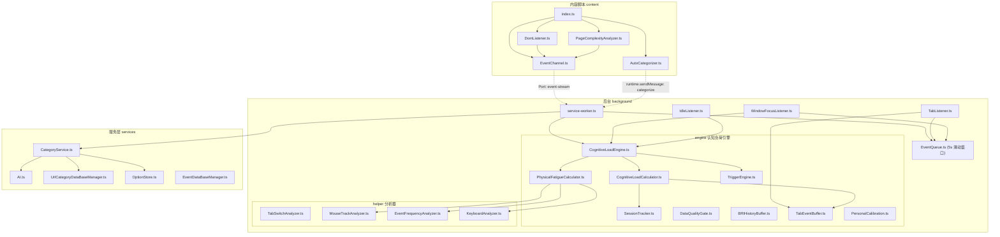
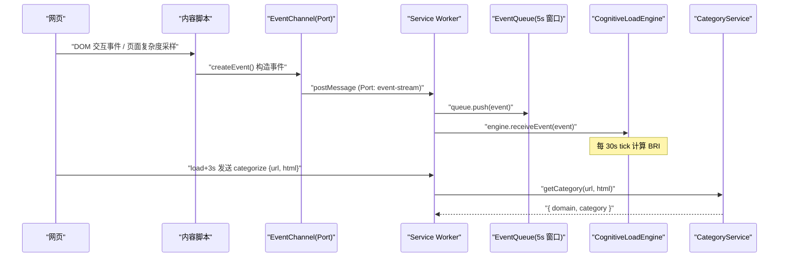

# 项目概述

<cite>
**本文引用的文件**
- [README.md](file://README.md)
- [package.json](file://package.json)
- [vite.config.ts](file://vite.config.ts)
- [manifest.ts](file://src/manifest.ts)
- [service-worker.ts](file://src/background/service-worker.ts)
- [CognitiveLoadEngine.ts](file://src/background/engine/CognitiveLoadEngine.ts)
- [EventQueue.ts](file://src/background/EventQueue.ts)
- [TabListener.ts](file://src/background/TabListener.ts)
- [WindowFocusListener.ts](file://src/background/WindowFocusListener.ts)
- [IdleListener.ts](file://src/background/IdleListener.ts)
- [index.ts](file://src/content/index.ts)
- [DomListener.ts](file://src/content/DomListener.ts)
- [EventChannel.ts](file://src/content/EventChannel.ts)
- [AutoCategorizer.ts](file://src/content/AutoCategorizer.ts)
- [PageComplexityAnalyzer.ts](file://src/content/PageComplexityAnalyzer.ts)
- [messages.ts](file://src/messages.ts)
- [Event.ts](file://src/models/events/Event.ts)
- [types.ts](file://src/models/types.ts)
- [Option.ts](file://src/models/Option.ts)
- [AI.ts](file://src/services/AI.ts)
- [CategoryService.ts](file://src/services/CategoryService.ts)
- [OptionStore.ts](file://src/services/OptionStore.ts)
- [UrlCategoryDataBaseManager.ts](file://src/services/UrlCategoryDataBaseManager.ts)
- [EventDataBaseManager.ts](file://src/services/EventDataBaseManager.ts)
- [App.tsx](file://src/popup/App.tsx)
- [main.tsx](file://src/popup/main.tsx)
</cite>

## 目录

1. [简介](#简介)
2. [项目结构](#项目结构)
3. [核心组件](#核心组件)
4. [端到端数据流](#端到端数据流)
5. [脑休息指数（BRI）计算](#脑休息指数bri计算)
6. [服务层能力](#服务层能力)
7. [当前实现状态](#当前实现状态)
8. [快速开始](#快速开始)

## 简介

BrainRest 是一个 Chrome Manifest V3 浏览器扩展，定位为"训练大脑更好休息"。它在后台持续采集浏览器与页面内的用户交互事件，基于
**认知负荷引擎**（每 30 秒 tick 一次）计算实时 **脑休息指数 BRI**（Brain Rest Index），并在满足触发条件时输出触发路径供前端决策；同时对访问过的站点做基于 AI 的 URL
分类，为认知负荷判定提供上下文。

项目遵循"内容脚本采集 → 后台处理 → 服务层能力"的职责分离：

- **内容脚本**（content）在页面中捕获 DOM 交互事件与页面复杂度快照，通过长连接 Port 上报后台；并在页面加载后请求对当前站点做分类。
- **后台服务**（background）在 Service Worker 中维护滑动窗口事件队列、监听标签页/窗口/空闲状态，并运行认知负荷引擎（`engine/`）。
- **服务层**（services）封装 AI 调用、URL 分类数据库、选项存储与事件数据库。
- **数据模型**（models）以 TypeScript 接口统一描述事件、配置与类型。

> 说明：弹出界面（popup）目前仅为占位页，尚未在 manifest 中启用。

**章节来源**

- [README.md](file://README.md)
- [manifest.ts](file://src/manifest.ts)
- [service-worker.ts](file://src/background/service-worker.ts)

## 项目结构



目录说明：

- `src/content`：DOM 事件采集、页面复杂度采样、事件通道、自动分类触发。
- `src/background`：Service Worker 入口、滑动窗口队列、浏览器级监听器。
- `src/background/engine`：认知负荷引擎核心（CognitiveLoadEngine、计算器、触发引擎、会话追踪、数据质量门控、历史缓冲、个人校准）。
- `src/background/helper`：底层信号分析器（鼠标轨迹熵、眼手延迟、事件频率、删除键占比、标签切换计数）。
- `src/services`：AI、URL 分类库、选项存储、事件数据库。
- `src/models`：事件模型、配置与共享类型。
- `src/popup`：React 占位界面。
- `src/manifest.ts`：MV3 清单配置。

**章节来源**

- [manifest.ts](file://src/manifest.ts)
- [service-worker.ts](file://src/background/service-worker.ts)
- [index.ts](file://src/content/index.ts)

## 核心组件

- **内容脚本 content**
    - [EventChannel.ts](file://src/content/EventChannel.ts)：通过 `chrome.runtime.connect({ name: "event-stream" })`
      建立长连接，`sendEvent()` 将事件 `postMessage` 给后台。
    - [DomListener.ts](file://src/content/DomListener.ts)：监听 `mousemove`（每 200ms 采样一次）、`click`、`keydown`/`keyup`、
      `scroll`、`touchstart`/`touchmove`/`touchend`、`fullscreenchange`，构造为事件模型后经通道上报。
    - [PageComplexityAnalyzer.ts](file://src/content/PageComplexityAnalyzer.ts)：页面加载后延迟 5s 首次采样，之后每 30s
      采样一次页面复杂度（文字密度、表格/代码/列表/标题数量），构造 `page_complexity` 事件经通道上报。
    - [AutoCategorizer.ts](file://src/content/AutoCategorizer.ts)：页面 `load` 后 3 秒，发送 `categorize` 运行时消息（携带
      `url` 与 `html`）给后台。

- **后台 background**
    - [service-worker.ts](file://src/background/service-worker.ts)：启动认知负荷引擎；接收
      `event-stream` Port 消息，将 `page_complexity` 转发引擎、`tab_activated` 写入 TabEventBuffer、所有事件入队并转发引擎；处理 `categorize` 消息并调用分类服务。
    - [EventQueue.ts](file://src/background/EventQueue.ts)：`SLIDE_WINDOW_MS = 5000` 的内存滑动窗口队列，仅提供 `push()` 与
      `getEvents()`。
    - [CognitiveLoadEngine.ts](file://src/background/engine/CognitiveLoadEngine.ts)：认知负荷引擎（单例），每 30s tick 计算 BRI。
    - [TabListener.ts](file://src/background/TabListener.ts) / [WindowFocusListener.ts](file://src/background/WindowFocusListener.ts) / [IdleListener.ts](file://src/background/IdleListener.ts)
      ：分别采集标签页、窗口焦点、系统锁屏状态。

- **服务层 services**
    - [CategoryService.ts](file://src/services/CategoryService.ts)、[AI.ts](file://src/services/AI.ts)、[UrlCategoryDataBaseManager.ts](file://src/services/UrlCategoryDataBaseManager.ts)、[OptionStore.ts](file://src/services/OptionStore.ts)、[EventDataBaseManager.ts](file://src/services/EventDataBaseManager.ts)。

**章节来源**

- [EventChannel.ts](file://src/content/EventChannel.ts)
- [DomListener.ts](file://src/content/DomListener.ts)
- [PageComplexityAnalyzer.ts](file://src/content/PageComplexityAnalyzer.ts)
- [AutoCategorizer.ts](file://src/content/AutoCategorizer.ts)
- [service-worker.ts](file://src/background/service-worker.ts)

## 端到端数据流



事件流当前只驻留在内存的 5 秒滑动窗口中（供 helper 分析器读取）；标签页/窗口监听器也直接向该队列 `push`。分类结果写入 IndexedDB（
`UrlCategoryDataBaseManager`），供引擎查询页面类型。

**章节来源**

- [DomListener.ts](file://src/content/DomListener.ts)
- [EventChannel.ts](file://src/content/EventChannel.ts)
- [service-worker.ts](file://src/background/service-worker.ts)
- [EventQueue.ts](file://src/background/EventQueue.ts)
- [CognitiveLoadEngine.ts](file://src/background/engine/CognitiveLoadEngine.ts)

## 脑休息指数（BRI）计算

[CognitiveLoadEngine.ts](file://src/background/engine/CognitiveLoadEngine.ts) 每 `TICK_MS = 30000` 毫秒执行一次 `tick()`：

1. **数据质量门控**：`DataQualityGate` 评估最近 120s 的数据覆盖率 `C_data`，低于 0.70 则输出 `insufficient_data` 不更新 BRI。
2. **计算 CL_cog（认知负荷 0-100）**：`CL_cog = 0.35·D + 0.15·B + 0.30·P + 0.20·T`
    - D = 时长得分（前台分钟 / 60 × 100）
    - B = 页面类型基线（查 `TYPE_BASELINE` 表，11 类映射）
    - P = 页面综合复杂度（0.70·ρ + 0.30·S）
    - T = 切换负荷（N_switch × 12.5 + N_load × 7.5）
3. **计算 CL_phy（身体疲劳 0-100）**：`CL_phy = [(0.30·E + 0.20·L + 0.25·I + 0.25·R) / 100] × (1 - R_rest/100) × 100`
    - E = 轨迹熵得分、L = 眼手延迟得分、I = 交互强度得分、R = 修正负荷（删除键占比）
    - R_rest = 休息衰减因子（锁屏 80 / 窗口失焦 50 / 鼠标静止 40 / 视频全屏 30）
4. **融合**：`BRI_raw = min(max(CL_cog, CL_phy) + 0.30 × min(CL_cog, CL_phy), 100)`
5. **校准**：`BRI = BRI_raw × k_personal`
6. **平滑**：`BRI_display(t) = 0.25 × min(BRI(t), 100) + 0.75 × BRI_display(t-1)`
7. **触发路径评估**（TriggerEngine）：硬门槛（前台≥30min、数据新鲜<120s、覆盖率≥0.70、冷却≥30min）+ 三条路径（A 持续高负荷 / B AUC 累积 / C 神经肌肉疲劳），命中结果附在 `BRIResult.triggerPath` 中，如何响应由前端决定。

**章节来源**

- [CognitiveLoadEngine.ts](file://src/background/engine/CognitiveLoadEngine.ts)
- [CognitiveLoadCalculator.ts](file://src/background/engine/CognitiveLoadCalculator.ts)
- [PhysicalFatigueCalculator.ts](file://src/background/engine/PhysicalFatigueCalculator.ts)
- [TriggerEngine.ts](file://src/background/engine/TriggerEngine.ts)

## 服务层能力

- **URL 分类**：[CategoryService.ts](file://src/services/CategoryService.ts) 先查 IndexedDB 缓存，未命中则调用
  AI（[AI.ts](file://src/services/AI.ts) 使用 OpenAI SDK，支持 openai/deepseek/自定义 URL），将站点归入 11
  个类别之一（见 [types.ts](file://src/models/types.ts)），结果写回分类库。
- **选项存储**：[OptionStore.ts](file://src/services/OptionStore.ts) 读写 `chrome.storage.local`（键 `brainrest_option`
  ），字段为 `aiProvider`/`categorifyModel`/`apiKey`，缺失时回退默认值。
- **事件数据库**：[EventDataBaseManager.ts](file://src/services/EventDataBaseManager.ts) 基于 `idb` 定义了事件持久化能力（含
  24h 清理），但当前运行链路尚未接入。

**章节来源**

- [CategoryService.ts](file://src/services/CategoryService.ts)
- [AI.ts](file://src/services/AI.ts)
- [OptionStore.ts](file://src/services/OptionStore.ts)
- [UrlCategoryDataBaseManager.ts](file://src/services/UrlCategoryDataBaseManager.ts)

## 当前实现状态

- ✅ 已实现：DOM/标签页/窗口/空闲事件采集、页面复杂度采样、5 秒滑动窗口、认知负荷引擎（CL_cog + CL_phy → BRI）、触发路径评估（A/B/C）、个人校准（k_personal）、数据质量门控、URL 分类（AI + IDB 缓存）、选项存储。
- ⚠️ 部分实现/未接入：`EventDataBaseManager`（事件持久化）已定义但未在链路中调用；`MediaEvent`/`TimeData` 为模型定义但无生产者。
- ❌ 未实现：BRI 触发后的提醒 UI（引擎仅输出 `triggerPath`，前端决策尚未实现）、弹出界面功能（占位）、manifest 中的 popup 入口（已注释）。

**章节来源**

- [service-worker.ts](file://src/background/service-worker.ts)
- [manifest.ts](file://src/manifest.ts)
- [App.tsx](file://src/popup/App.tsx)

## 快速开始

```bash
npm install       # 安装依赖
npm run dev       # 开发模式（Vite + CRXJS）
npm run build     # tsc -b && vite build 生成 dist
npm run lint      # ESLint 检查
```

构建后在浏览器扩展页开启开发者模式，加载 `dist` 目录即可。运行 AI 分类需在 `chrome.storage.local` 的 `brainrest_option`
中配置有效 `apiKey`。

**章节来源**

- [package.json](file://package.json)
- [vite.config.ts](file://vite.config.ts)
- [README.md](file://README.md)
